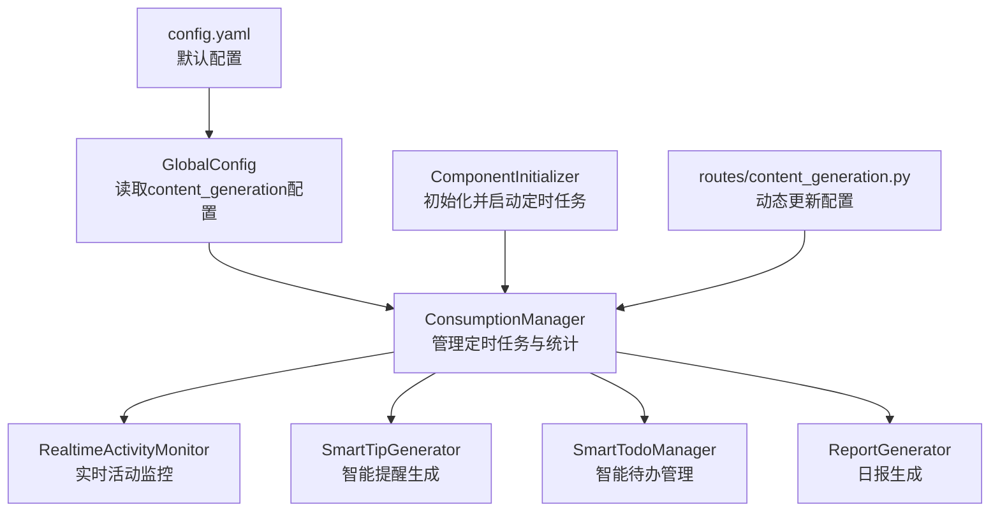
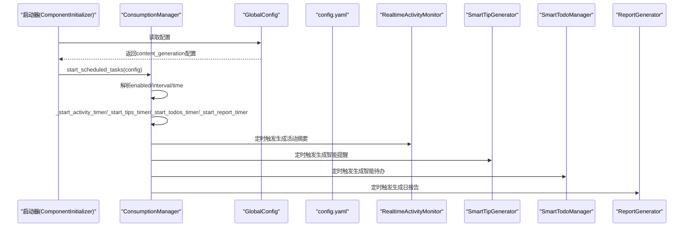
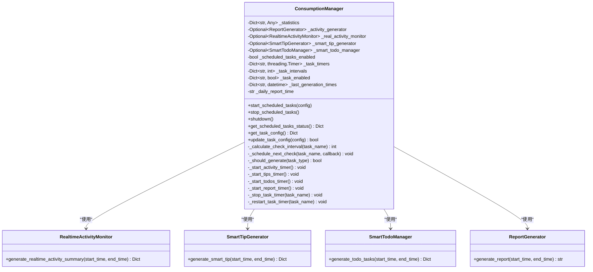
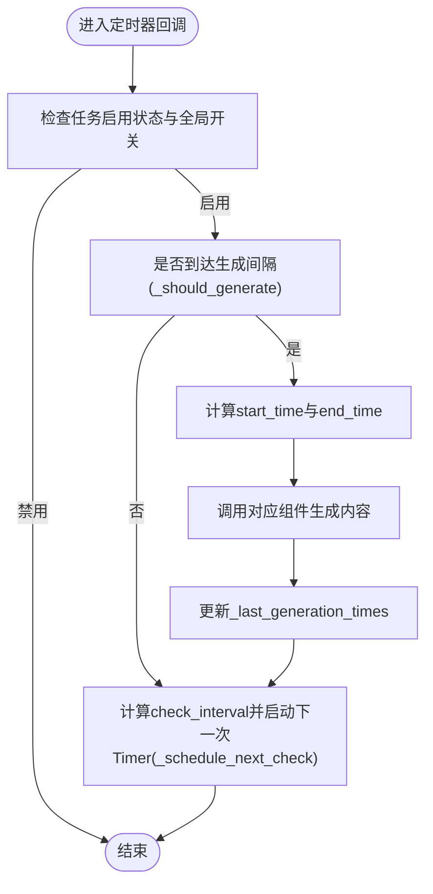
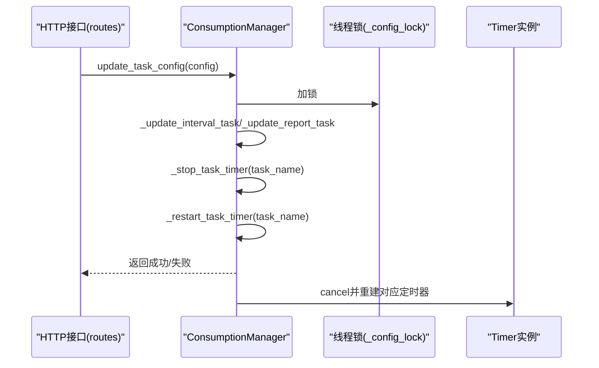
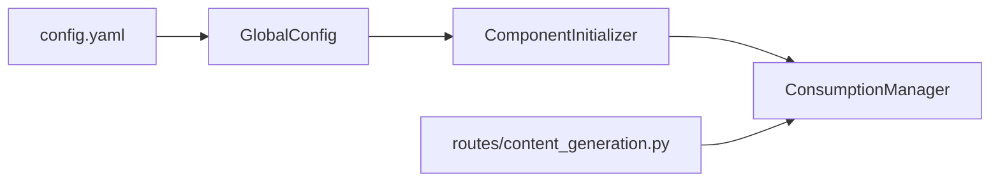

# 消费管理器

<cite>
**本文引用的文件列表**
- [opencontext/managers/consumption_manager.py](file://opencontext/managers/consumption_manager.py)
- [opencontext/context_consumption/generation/realtime_activity_monitor.py](file://opencontext/context_consumption/generation/realtime_activity_monitor.py)
- [opencontext/context_consumption/generation/smart_tip_generator.py](file://opencontext/context_consumption/generation/smart_tip_generator.py)
- [opencontext/context_consumption/generation/smart_todo_manager.py](file://opencontext/context_consumption/generation/smart_todo_manager.py)
- [opencontext/context_consumption/generation/generation_report.py](file://opencontext/context_consumption/generation/generation_report.py)
- [config/config.yaml](file://config/config.yaml)
- [opencontext/config/global_config.py](file://opencontext/config/global_config.py)
- [opencontext/server/component_initializer.py](file://opencontext/server/component_initializer.py)
- [opencontext/server/routes/content_generation.py](file://opencontext/server/routes/content_generation.py)
</cite>

## 目录
1. [简介](#简介)
2. [项目结构](#项目结构)
3. [核心组件](#核心组件)
4. [架构总览](#架构总览)
5. [详细组件分析](#详细组件分析)
6. [依赖分析](#依赖分析)
7. [性能考量](#性能考量)
8. [故障排查指南](#故障排查指南)
9. [结论](#结论)
10. [附录：自定义消费任务开发指南](#附录自定义消费任务开发指南)

## 简介
本文件面向“消费管理器”（ConsumptionManager）的实现与使用，系统化梳理其如何基于配置启动并维护四类定时任务：实时活动（activity）、智能提醒（tips）、智能待办（todos）与日报（report）。文档重点解释：
- 如何通过_start_scheduled_tasks根据配置启动各类定时器；
- _start_activity_timer、_start_tips_timer、_start_todos_timer、_start_report_timer如何借助threading.Timer实现周期性任务调度；
- _calculate_check_interval与generation_interval之间的计算关系；
- _real_activity_monitor、_smart_tip_generator等消费组件如何与定时器协作生成洞察；
- _update_task_config动态更新机制如何通过_stop_task_timer与_restart_task_timer实现配置热更新；
- 提供自定义消费任务的开发指南。

## 项目结构
围绕消费管理器的关键文件组织如下：
- 管理器：opencontext/managers/consumption_manager.py
- 消费组件：实时活动监控、智能提醒生成、智能待办管理、日报生成
- 配置来源：config/config.yaml、opencontext/config/global_config.py
- 启动入口：opencontext/server/component_initializer.py
- 动态配置接口：opencontext/server/routes/content_generation.py

图表来源
- [opencontext/managers/consumption_manager.py](file://opencontext/managers/consumption_manager.py#L56-L87)
- [opencontext/context_consumption/generation/realtime_activity_monitor.py](file://opencontext/context_consumption/generation/realtime_activity_monitor.py#L60-L122)
- [opencontext/context_consumption/generation/smart_tip_generator.py](file://opencontext/context_consumption/generation/smart_tip_generator.py#L46-L87)
- [opencontext/context_consumption/generation/smart_todo_manager.py](file://opencontext/context_consumption/generation/smart_todo_manager.py#L52-L132)
- [opencontext/context_consumption/generation/generation_report.py](file://opencontext/context_consumption/generation/generation_report.py#L34-L74)
- [config/config.yaml](file://config/config.yaml#L217-L239)
- [opencontext/config/global_config.py](file://opencontext/config/global_config.py#L236-L262)
- [opencontext/server/component_initializer.py](file://opencontext/server/component_initializer.py#L199-L207)
- [opencontext/server/routes/content_generation.py](file://opencontext/server/routes/content_generation.py#L120-L143)

章节来源
- [opencontext/managers/consumption_manager.py](file://opencontext/managers/consumption_manager.py#L56-L87)
- [config/config.yaml](file://config/config.yaml#L217-L239)
- [opencontext/config/global_config.py](file://opencontext/config/global_config.py#L236-L262)
- [opencontext/server/component_initializer.py](file://opencontext/server/component_initializer.py#L199-L207)

## 核心组件
- ConsumptionManager：统一管理四类消费任务的启停、调度与统计；负责从全局配置加载任务开关与间隔；通过threading.Timer实现周期性检查与生成。
- RealtimeActivityMonitor：按时间窗口抓取上下文，生成活动摘要、洞察与代表性资源，写入数据库并发布事件。
- SmartTipGenerator：综合近期活动与历史提醒，生成个性化提醒，避免重复并发布事件。
- SmartTodoManager：结合活动洞察与上下文，抽取高价值待办，去重后入库并发布事件。
- ReportGenerator：按小时切片并发拉取上下文、提醒、待办与活动，异步汇总生成日报告，入库并发布事件。

章节来源
- [opencontext/managers/consumption_manager.py](file://opencontext/managers/consumption_manager.py#L31-L87)
- [opencontext/context_consumption/generation/realtime_activity_monitor.py](file://opencontext/context_consumption/generation/realtime_activity_monitor.py#L60-L122)
- [opencontext/context_consumption/generation/smart_tip_generator.py](file://opencontext/context_consumption/generation/smart_tip_generator.py#L46-L87)
- [opencontext/context_consumption/generation/smart_todo_manager.py](file://opencontext/context_consumption/generation/smart_todo_manager.py#L52-L132)
- [opencontext/context_consumption/generation/generation_report.py](file://opencontext/context_consumption/generation/generation_report.py#L34-L74)

## 架构总览
下图展示消费管理器与各消费组件、配置与启动流程的关系。

图表来源
- [opencontext/server/component_initializer.py](file://opencontext/server/component_initializer.py#L199-L207)
- [opencontext/managers/consumption_manager.py](file://opencontext/managers/consumption_manager.py#L132-L155)
- [config/config.yaml](file://config/config.yaml#L217-L239)
- [opencontext/config/global_config.py](file://opencontext/config/global_config.py#L236-L262)

## 详细组件分析

### ConsumptionManager：定时任务与配置管理
- 初始化阶段
  - 从GlobalConfig读取content_generation配置，填充_task_enabled与_task_intervals，并初始化_last_generation_times。
  - 实例化四个消费组件：ReportGenerator、RealtimeActivityMonitor、SmartTipGenerator、SmartTodoManager。
- 启停控制
  - start_scheduled_tasks：根据传入配置或默认配置启动各类定时器；内部调用_start_report_timer、_start_activity_timer、_start_tips_timer、_start_todos_timer。
  - stop_scheduled_tasks：取消所有已注册的threading.Timer并清空字典。
- 调度策略
  - _calculate_check_interval：将生成间隔（generation_interval）按固定上限折算为检查间隔（check_interval），确保高频任务不会过于频繁地轮询。
  - _schedule_next_check：在回调中再次启动下一个Timer，形成周期性循环。
  - _should_generate：判断是否到达生成间隔，避免重复生成。
- 日报调度
  - _start_report_timer：每日固定时刻触发，若当日未生成则生成一次；随后每30分钟检查一次，防止错过目标时刻。
  - _calculate_seconds_until_daily_time：计算到目标时刻的秒数，异常时回退为24小时。
  - _get_last_report_time：从数据库最近一条日报记录推断上次生成日期，避免同日重复。
- 动态配置更新
  - update_task_config：原子性更新activity/tips/todos/report配置，内部通过_stop_task_timer与_restart_task_timer实现热重启。
  - _update_interval_task/_update_report_task：分别处理间隔型任务与日报任务的启用状态与时间调整。
  - _stop_task_timer/_restart_task_timer：停止旧Timer并按当前状态重新启动对应类型定时器。
- 统计与查询
  - get_scheduled_tasks_status/get_task_config：返回当前运行状态、间隔与启用状态等信息。
  - get_statistics/reset_statistics：提供消费统计与重置能力。

章节来源
- [opencontext/managers/consumption_manager.py](file://opencontext/managers/consumption_manager.py#L56-L87)
- [opencontext/managers/consumption_manager.py](file://opencontext/managers/consumption_manager.py#L132-L155)
- [opencontext/managers/consumption_manager.py](file://opencontext/managers/consumption_manager.py#L171-L241)
- [opencontext/managers/consumption_manager.py](file://opencontext/managers/consumption_manager.py#L243-L356)
- [opencontext/managers/consumption_manager.py](file://opencontext/managers/consumption_manager.py#L358-L371)
- [opencontext/managers/consumption_manager.py](file://opencontext/managers/consumption_manager.py#L380-L401)
- [opencontext/managers/consumption_manager.py](file://opencontext/managers/consumption_manager.py#L402-L511)

#### 类关系图

图表来源
- [opencontext/managers/consumption_manager.py](file://opencontext/managers/consumption_manager.py#L31-L87)
- [opencontext/context_consumption/generation/realtime_activity_monitor.py](file://opencontext/context_consumption/generation/realtime_activity_monitor.py#L60-L122)
- [opencontext/context_consumption/generation/smart_tip_generator.py](file://opencontext/context_consumption/generation/smart_tip_generator.py#L46-L87)
- [opencontext/context_consumption/generation/smart_todo_manager.py](file://opencontext/context_consumption/generation/smart_todo_manager.py#L52-L132)
- [opencontext/context_consumption/generation/generation_report.py](file://opencontext/context_consumption/generation/generation_report.py#L34-L74)

### 定时器启动流程与调度逻辑
- _start_activity_timer
  - 计算check_interval = min(上限, generation_interval // 4)，然后启动Timer。
  - 回调中先判断_should_generate，再计算start_time（最近一次生成时间或按间隔回溯），调用_real_activity_monitor生成摘要并更新_last_generation_times。
  - 最后通过_schedule_next_check继续下一轮。
- _start_tips_timer/_start_todos_timer
  - 逻辑与_activity类似，但分别调用_smart_tip_generator与_smart_todo_manager，并更新对应的_last_generation_times。
- _start_report_timer
  - 每次回调检查当前时间是否达到目标时刻且当日未生成过，则生成一次日报；随后每30分钟检查一次，保证不会错过目标时刻。
  - 通过_get_last_report_time与_last_report_date避免重复生成。

图表来源
- [opencontext/managers/consumption_manager.py](file://opencontext/managers/consumption_manager.py#L243-L356)
- [opencontext/managers/consumption_manager.py](file://opencontext/managers/consumption_manager.py#L358-L371)

章节来源
- [opencontext/managers/consumption_manager.py](file://opencontext/managers/consumption_manager.py#L243-L356)
- [opencontext/managers/consumption_manager.py](file://opencontext/managers/consumption_manager.py#L358-L371)

### _calculate_check_interval与generation_interval的计算关系
- 计算公式：check_interval = min(上限, generation_interval // 4)
- 上限限制：
  - activity：180秒
  - tips：200秒
  - todos：250秒
- 设计意图：
  - 将生成间隔拆分为多个检查点，降低单次生成成本与抖动风险；
  - 对高频任务（如activity）采用更短的check_interval，提高响应灵敏度；
  - 对低频任务（如report）通过独立的每日触发逻辑，避免与check_interval耦合。

章节来源
- [opencontext/managers/consumption_manager.py](file://opencontext/managers/consumption_manager.py#L358-L364)

### 消费组件协作与洞察产出
- RealtimeActivityMonitor
  - 从存储检索指定时间窗口内的上下文，生成摘要、类别分布与洞察，写入活动表并发布事件。
- SmartTipGenerator
  - 分析最近活动模式、关键实体与建议，结合历史提醒避免重复，生成提醒并发布事件。
- SmartTodoManager
  - 基于活动洞察与相关上下文抽取待办，进行向量去重与后处理，入库并发布事件。
- ReportGenerator
  - 按小时切片并发拉取上下文、提醒、待办与活动，异步汇总生成日报告，入库并发布事件。

章节来源
- [opencontext/context_consumption/generation/realtime_activity_monitor.py](file://opencontext/context_consumption/generation/realtime_activity_monitor.py#L60-L122)
- [opencontext/context_consumption/generation/smart_tip_generator.py](file://opencontext/context_consumption/generation/smart_tip_generator.py#L46-L87)
- [opencontext/context_consumption/generation/smart_todo_manager.py](file://opencontext/context_consumption/generation/smart_todo_manager.py#L52-L132)
- [opencontext/context_consumption/generation/generation_report.py](file://opencontext/context_consumption/generation/generation_report.py#L34-L74)

### 动态配置热更新机制
- update_task_config
  - 支持对activity/tips/todos的enabled与interval以及report的enabled与time进行原子更新。
  - 内部通过_stop_task_timer与_restart_task_timer实现热重启，确保新配置立即生效。
- _update_interval_task/_update_report_task
  - 处理enabled变化与interval/time变更，必要时触发重启。
- _stop_task_timer/_restart_task_timer
  - 取消旧Timer并按当前状态重新启动对应类型定时器。

图表来源
- [opencontext/server/routes/content_generation.py](file://opencontext/server/routes/content_generation.py#L120-L143)
- [opencontext/managers/consumption_manager.py](file://opencontext/managers/consumption_manager.py#L402-L511)

章节来源
- [opencontext/server/routes/content_generation.py](file://opencontext/server/routes/content_generation.py#L120-L143)
- [opencontext/managers/consumption_manager.py](file://opencontext/managers/consumption_manager.py#L402-L511)

## 依赖分析
- 配置来源
  - GlobalConfig从config.yaml读取content_generation配置，提供enabled与interval/time字段。
- 启动入口
  - ComponentInitializer在服务启动时读取content_generation配置并调用ConsumptionManager.start_scheduled_tasks。
- 接口层
  - routes/content_generation.py提供动态更新接口，调用ConsumptionManager.update_task_config，并将最新配置写回用户设置文件。

图表来源
- [config/config.yaml](file://config/config.yaml#L217-L239)
- [opencontext/config/global_config.py](file://opencontext/config/global_config.py#L236-L262)
- [opencontext/server/component_initializer.py](file://opencontext/server/component_initializer.py#L199-L207)
- [opencontext/server/routes/content_generation.py](file://opencontext/server/routes/content_generation.py#L120-L143)

章节来源
- [config/config.yaml](file://config/config.yaml#L217-L239)
- [opencontext/server/component_initializer.py](file://opencontext/server/component_initializer.py#L199-L207)
- [opencontext/server/routes/content_generation.py](file://opencontext/server/routes/content_generation.py#L120-L143)

## 性能考量
- 检查间隔与生成间隔
  - 通过_check_interval = min(上限, generation_interval // 4)平衡CPU占用与响应速度；对高频任务采用更短检查间隔。
- 并发与异步
  - 日报生成采用按小时切片并发处理与异步汇总，减少长耗时任务阻塞。
- 去重与缓存
  - 待办生成阶段使用向量相似度去重，降低重复任务入库概率。
- I/O与事件
  - 生成完成后发布事件，便于前端与其它模块感知，避免轮询带来的额外开销。

[本节为通用指导，不直接分析具体文件]

## 故障排查指南
- 定时器未启动
  - 检查content_generation配置中的enabled与interval是否正确；确认GlobalConfig已加载配置。
- 生成频率异常
  - 核对_check_interval与generation_interval关系；确认_last_generation_times是否被正确更新。
- 日报未按时生成
  - 检查_report_time与_get_last_report_time逻辑；确认数据库存在最近日报记录。
- 动态配置未生效
  - 确认update_task_config调用路径；检查_stop_task_timer与_restart_task_timer是否执行。
- 组件异常
  - 查看各组件日志输出，定位存储查询、模型调用或解析JSON阶段的问题。

章节来源
- [opencontext/managers/consumption_manager.py](file://opencontext/managers/consumption_manager.py#L171-L241)
- [opencontext/context_consumption/generation/realtime_activity_monitor.py](file://opencontext/context_consumption/generation/realtime_activity_monitor.py#L130-L132)
- [opencontext/context_consumption/generation/smart_tip_generator.py](file://opencontext/context_consumption/generation/smart_tip_generator.py#L85-L87)
- [opencontext/context_consumption/generation/smart_todo_manager.py](file://opencontext/context_consumption/generation/smart_todo_manager.py#L130-L132)
- [opencontext/context_consumption/generation/generation_report.py](file://opencontext/context_consumption/generation/generation_report.py#L70-L74)

## 结论
ConsumptionManager通过清晰的配置驱动与线程定时器机制，实现了对实时活动、智能提醒、智能待办与日报的稳定调度。其检查间隔与生成间隔的解耦设计兼顾了性能与响应速度；动态配置热更新保障了运行期可调性；消费组件与事件发布形成了良好的扩展基础。对于新增消费任务，建议遵循现有组件的接口风格与错误处理规范，复用全局配置与事件机制。

[本节为总结性内容，不直接分析具体文件]

## 附录：自定义消费任务开发指南
- 步骤一：定义任务组件
  - 新建一个类，提供生成方法（如generate_xxx），接收start_time与end_time参数，完成数据拉取、分析与落库，并发布相应事件。
  - 参考现有组件的接口风格与错误处理方式。
- 步骤二：接入ConsumptionManager
  - 在ConsumptionManager中：
    - 在__init__中实例化你的组件；
    - 在_start_xxx_timer中实现定时触发逻辑，调用组件生成方法；
    - 在_schedule_next_check中安排下一次回调；
    - 在_update_xxx_task中支持enabled与interval的热更新。
- 步骤三：配置与启动
  - 在config.yaml的content_generation中添加你的任务项（enabled与interval）；
  - 在ComponentInitializer中确保启动时加载content_generation配置并调用start_scheduled_tasks。
- 步骤四：动态更新
  - 通过routes/content_generation.py提供的接口调用update_task_config，验证_stop_task_timer与_restart_task_timer是否生效。
- 步骤五：测试与监控
  - 关注日志输出与事件发布，验证生成结果与去重/并发策略是否符合预期。

章节来源
- [opencontext/context_consumption/generation/realtime_activity_monitor.py](file://opencontext/context_consumption/generation/realtime_activity_monitor.py#L60-L122)
- [opencontext/context_consumption/generation/smart_tip_generator.py](file://opencontext/context_consumption/generation/smart_tip_generator.py#L46-L87)
- [opencontext/context_consumption/generation/smart_todo_manager.py](file://opencontext/context_consumption/generation/smart_todo_manager.py#L52-L132)
- [opencontext/context_consumption/generation/generation_report.py](file://opencontext/context_consumption/generation/generation_report.py#L34-L74)
- [config/config.yaml](file://config/config.yaml#L217-L239)
- [opencontext/server/component_initializer.py](file://opencontext/server/component_initializer.py#L199-L207)
- [opencontext/server/routes/content_generation.py](file://opencontext/server/routes/content_generation.py#L120-L143)