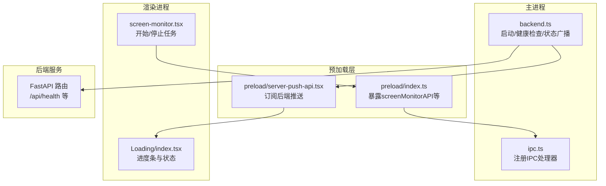
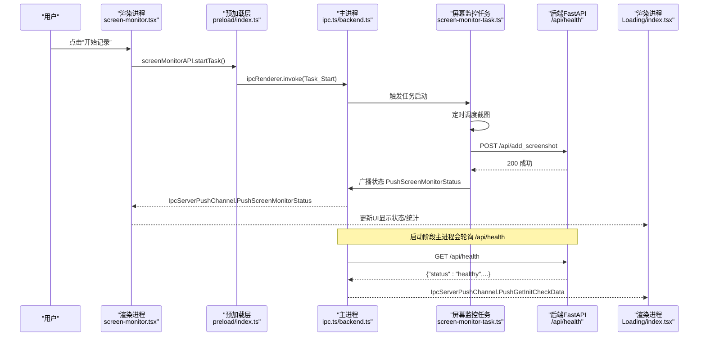
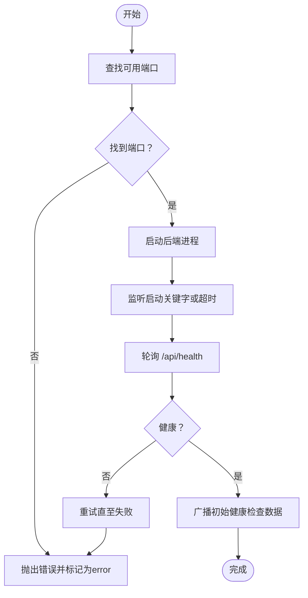
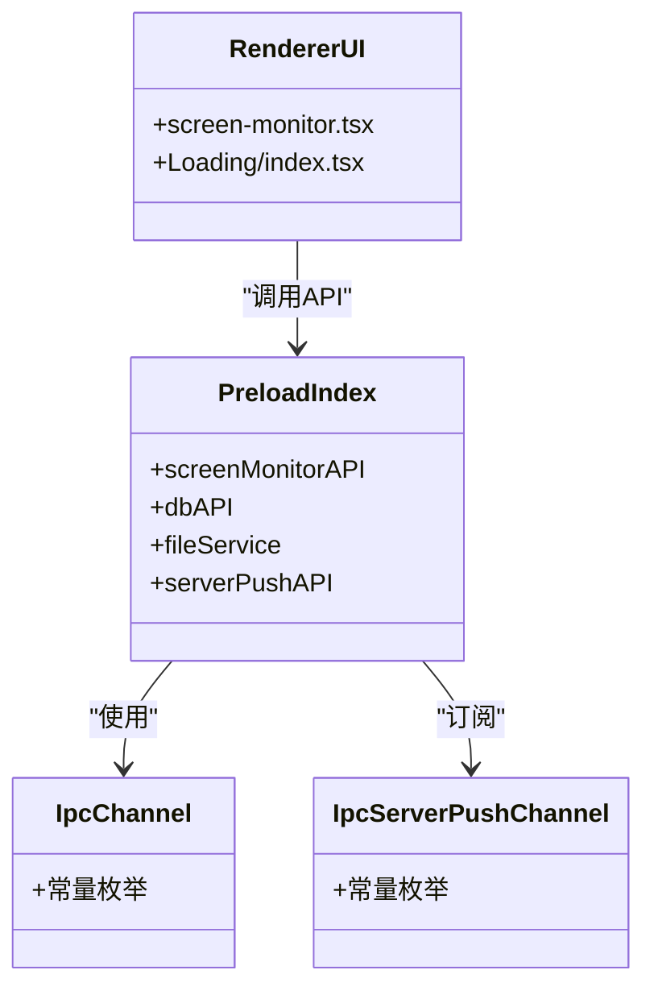
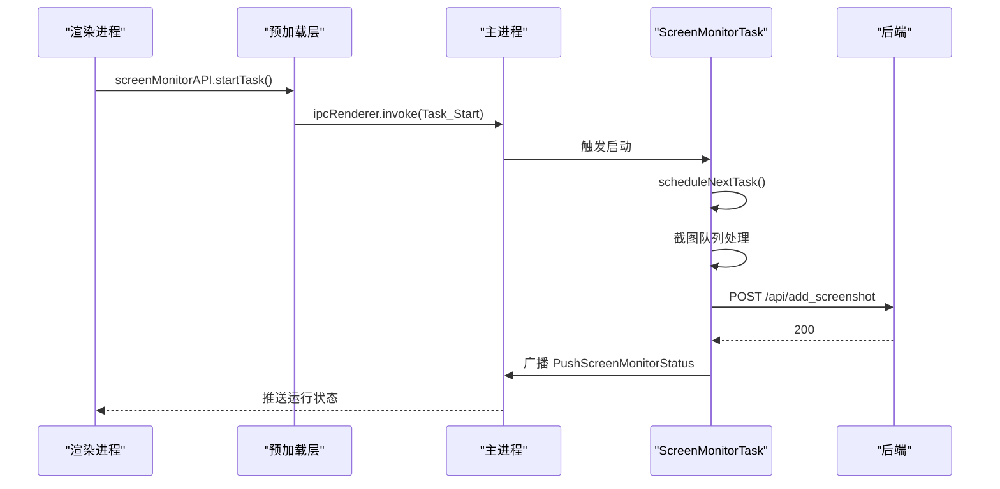
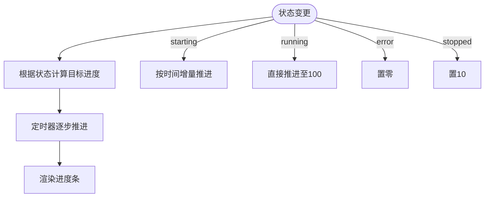
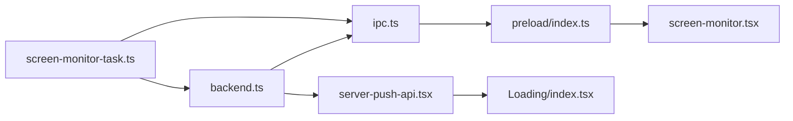

# 数据流与通信

<cite>
**本文引用的文件**
- [frontend/src/main/backend.ts](file://frontend/src/main/backend.ts)
- [opencontext/server/routes/health.py](file://opencontext/server/routes/health.py)
- [frontend/packages/shared/IpcChannel.ts](file://frontend/packages/shared/IpcChannel.ts)
- [frontend/packages/shared/ipc-server-push-channel.ts](file://frontend/packages/shared/ipc-server-push-channel.ts)
- [frontend/src/main/ipc.ts](file://frontend/src/main/ipc.ts)
- [frontend/src/preload/index.ts](file://frontend/src/preload/index.ts)
- [frontend/src/preload/server-push-api.tsx](file://frontend/src/preload/server-push-api.tsx)
- [frontend/src/renderer/src/components/Loading/index.tsx](file://frontend/src/renderer/src/components/Loading/index.tsx)
- [frontend/src/main/background/task/screen-monitor-task.ts](file://frontend/src/main/background/task/screen-monitor-task.ts)
- [frontend/src/main/background/task/schedule-next-task.ts](file://frontend/src/main/background/task/schedule-next-task.ts)
- [frontend/src/renderer/src/pages/screen-monitor/screen-monitor.tsx](file://frontend/src/renderer/src/pages/screen-monitor/screen-monitor.tsx)
</cite>

## 目录
1. [简介](#简介)
2. [项目结构](#项目结构)
3. [核心组件](#核心组件)
4. [架构总览](#架构总览)
5. [详细组件分析](#详细组件分析)
6. [依赖关系分析](#依赖关系分析)
7. [性能考量](#性能考量)
8. [故障排查指南](#故障排查指南)
9. [结论](#结论)

## 简介
本文件聚焦于系统内“主进程-预加载层-渲染进程”之间的数据流与通信机制，围绕以下目标展开：
- 主进程如何通过后台启动Python后端（Electron主进程调用startBackendInBackground），并通过HTTP请求对后端的/api/health端点进行健康检查。
- 双向通信机制：IpcChannel定义的IPC通道如何将前端UI事件（例如“开始捕获”）转化为对后端API的调用；后端处理结果如何通过推送通道回传到前端。
- 使用时序图完整展示“用户点击开始记录 -> IPC消息 -> 后端API调用 -> 捕获/处理/存储 -> 结果返回 -> UI更新”的全流程。
- 错误处理策略：端口占用、连接拒绝等异常场景的处理方法。
- 进度条与后端状态同步：以Loading/index.tsx为例说明UI如何基于后端状态动态更新。

## 项目结构
系统采用典型的Electron三层结构：
- 主进程：负责后端生命周期管理、IPC注册、与后端HTTP交互。
- 预加载层：在隔离上下文中暴露安全API给渲染进程，封装ipcRenderer调用与后端推送事件监听。
- 渲染进程：承载UI逻辑，发起任务控制与状态查询，接收后端推送并更新界面。

图表来源
- [frontend/src/main/backend.ts](file://frontend/src/main/backend.ts#L347-L582)
- [frontend/src/main/ipc.ts](file://frontend/src/main/ipc.ts#L533-L609)
- [frontend/src/preload/index.ts](file://frontend/src/preload/index.ts#L86-L108)
- [frontend/src/preload/server-push-api.tsx](file://frontend/src/preload/server-push-api.tsx#L1-L47)
- [opencontext/server/routes/health.py](file://opencontext/server/routes/health.py#L19-L41)
- [frontend/src/renderer/src/pages/screen-monitor/screen-monitor.tsx](file://frontend/src/renderer/src/pages/screen-monitor/screen-monitor.tsx#L171-L194)
- [frontend/src/renderer/src/components/Loading/index.tsx](file://frontend/src/renderer/src/components/Loading/index.tsx#L1-L92)

章节来源
- [frontend/src/main/backend.ts](file://frontend/src/main/backend.ts#L347-L582)
- [frontend/src/main/ipc.ts](file://frontend/src/main/ipc.ts#L533-L609)
- [frontend/src/preload/index.ts](file://frontend/src/preload/index.ts#L86-L108)
- [frontend/src/preload/server-push-api.tsx](file://frontend/src/preload/server-push-api.tsx#L1-L47)
- [opencontext/server/routes/health.py](file://opencontext/server/routes/health.py#L19-L41)
- [frontend/src/renderer/src/pages/screen-monitor/screen-monitor.tsx](file://frontend/src/renderer/src/pages/screen-monitor/screen-monitor.tsx#L171-L194)
- [frontend/src/renderer/src/components/Loading/index.tsx](file://frontend/src/renderer/src/components/Loading/index.tsx#L1-L92)

## 核心组件
- 后端启动与健康检查：主进程负责寻找可用端口、启动后端可执行文件、等待启动完成并轮询/api/health，最终通过IpcServerPushChannel推送初始健康检查结果。
- IPC通道：IpcChannel集中定义了前后端交互的消息名，包括任务控制、屏幕监控、数据库、设置等；IpcServerPushChannel定义了从后端推送至前端的事件通道。
- 预加载API桥接：preload/index.ts将ipcRenderer.invoke封装为screenMonitorAPI等，供渲染进程直接调用；server-push-api.tsx订阅后端推送事件。
- 屏幕监控任务：screen-monitor-task.ts通过定时调度周期性截图并上传到后端；同时通过IpcServerPushChannel向前端推送运行状态。
- 健康检查路由：后端FastAPI提供/api/health接口，返回服务健康状态。

章节来源
- [frontend/src/main/backend.ts](file://frontend/src/main/backend.ts#L39-L137)
- [frontend/packages/shared/IpcChannel.ts](file://frontend/packages/shared/IpcChannel.ts#L325-L348)
- [frontend/packages/shared/ipc-server-push-channel.ts](file://frontend/packages/shared/ipc-server-push-channel.ts#L1-L12)
- [frontend/src/preload/index.ts](file://frontend/src/preload/index.ts#L86-L108)
- [frontend/src/main/background/task/screen-monitor-task.ts](file://frontend/src/main/background/task/screen-monitor-task.ts#L1-L259)
- [opencontext/server/routes/health.py](file://opencontext/server/routes/health.py#L19-L41)

## 架构总览
下图展示了从用户点击“开始记录”到后端处理与UI更新的完整链路。

图表来源
- [frontend/src/renderer/src/pages/screen-monitor/screen-monitor.tsx](file://frontend/src/renderer/src/pages/screen-monitor/screen-monitor.tsx#L171-L194)
- [frontend/src/preload/index.ts](file://frontend/src/preload/index.ts#L86-L108)
- [frontend/src/main/ipc.ts](file://frontend/src/main/ipc.ts#L583-L609)
- [frontend/src/main/backend.ts](file://frontend/src/main/backend.ts#L347-L582)
- [frontend/src/main/background/task/screen-monitor-task.ts](file://frontend/src/main/background/task/screen-monitor-task.ts#L100-L220)
- [opencontext/server/routes/health.py](file://opencontext/server/routes/health.py#L19-L41)
- [frontend/src/preload/server-push-api.tsx](file://frontend/src/preload/server-push-api.tsx#L1-L47)
- [frontend/src/renderer/src/components/Loading/index.tsx](file://frontend/src/renderer/src/components/Loading/index.tsx#L1-L92)

## 详细组件分析

### 组件A：后端启动与健康检查（主进程）
- 端口选择：通过端口探测算法寻找可用端口，默认起始端口为1733，最多尝试若干次。
- 启动后端：定位可执行文件路径，准备工作目录与环境变量，spawn子进程启动后端服务。
- 启动检测：监听stdout/stderr输出中的启动关键字，或在超时后主动发起健康检查。
- 健康检查：轮询后端/api/health端点，失败重试固定次数，成功后广播初始健康检查数据。
- 状态广播：通过IpcChannel.Backend_StatusChanged与IpcServerPushChannel.PushGetInitCheckData向渲染进程推送状态与健康检查结果。

图表来源
- [frontend/src/main/backend.ts](file://frontend/src/main/backend.ts#L39-L137)
- [frontend/src/main/backend.ts](file://frontend/src/main/backend.ts#L347-L582)
- [opencontext/server/routes/health.py](file://opencontext/server/routes/health.py#L19-L41)

章节来源
- [frontend/src/main/backend.ts](file://frontend/src/main/backend.ts#L39-L137)
- [frontend/src/main/backend.ts](file://frontend/src/main/backend.ts#L347-L582)
- [opencontext/server/routes/health.py](file://opencontext/server/routes/health.py#L19-L41)

### 组件B：IPC通道与预加载API桥接
- IpcChannel集中定义了前后端交互的消息名，涵盖任务控制、屏幕监控、数据库、设置等。
- 预加载层将ipcRenderer.invoke封装为screenMonitorAPI，渲染进程通过window.screenMonitorAPI调用主进程处理程序。
- IpcServerPushChannel定义了后端推送通道，预加载层通过ipcRenderer.on订阅，再由UI组件消费。

图表来源
- [frontend/packages/shared/IpcChannel.ts](file://frontend/packages/shared/IpcChannel.ts#L325-L348)
- [frontend/packages/shared/ipc-server-push-channel.ts](file://frontend/packages/shared/ipc-server-push-channel.ts#L1-L12)
- [frontend/src/preload/index.ts](file://frontend/src/preload/index.ts#L86-L108)
- [frontend/src/preload/server-push-api.tsx](file://frontend/src/preload/server-push-api.tsx#L1-L47)
- [frontend/src/renderer/src/pages/screen-monitor/screen-monitor.tsx](file://frontend/src/renderer/src/pages/screen-monitor/screen-monitor.tsx#L171-L194)
- [frontend/src/renderer/src/components/Loading/index.tsx](file://frontend/src/renderer/src/components/Loading/index.tsx#L1-L92)

章节来源
- [frontend/packages/shared/IpcChannel.ts](file://frontend/packages/shared/IpcChannel.ts#L325-L348)
- [frontend/packages/shared/ipc-server-push-channel.ts](file://frontend/packages/shared/ipc-server-push-channel.ts#L1-L12)
- [frontend/src/preload/index.ts](file://frontend/src/preload/index.ts#L86-L108)
- [frontend/src/preload/server-push-api.tsx](file://frontend/src/preload/server-push-api.tsx#L1-L47)

### 组件C：屏幕监控任务与后端API调用
- 任务控制：渲染进程通过screenMonitorAPI.startTask/stopTask触发主进程注册的Task_Start/Task_Stop处理器，进而驱动ScreenMonitorTask的状态切换。
- 定时调度：ScreenMonitorTask基于ScheduleNextTask按配置间隔执行截图任务，内部使用队列并发处理截图。
- 截图上传：截图成功后调用后端POST /api/add_screenshot，携带图片路径与类型信息。
- 状态推送：ScreenMonitorTask通过IpcServerPushChannel.PushScreenMonitorStatus向前端推送运行状态，渲染进程订阅并更新UI。

图表来源
- [frontend/src/renderer/src/pages/screen-monitor/screen-monitor.tsx](file://frontend/src/renderer/src/pages/screen-monitor/screen-monitor.tsx#L171-L194)
- [frontend/src/preload/index.ts](file://frontend/src/preload/index.ts#L86-L108)
- [frontend/src/main/ipc.ts](file://frontend/src/main/ipc.ts#L583-L609)
- [frontend/src/main/background/task/screen-monitor-task.ts](file://frontend/src/main/background/task/screen-monitor-task.ts#L100-L220)
- [frontend/src/main/background/task/schedule-next-task.ts](file://frontend/src/main/background/task/schedule-next-task.ts#L1-L53)

章节来源
- [frontend/src/renderer/src/pages/screen-monitor/screen-monitor.tsx](file://frontend/src/renderer/src/pages/screen-monitor/screen-monitor.tsx#L171-L194)
- [frontend/src/main/background/task/screen-monitor-task.ts](file://frontend/src/main/background/task/screen-monitor-task.ts#L100-L220)
- [frontend/src/main/background/task/schedule-next-task.ts](file://frontend/src/main/background/task/schedule-next-task.ts#L1-L53)

### 组件D：健康检查与后端状态同步（Loading）
- Loading组件根据后端状态计算进度百分比：stopped为10%，starting为10%~99%之间随时间平滑推进，running为100%，error为0。
- 主进程在健康检查通过后，通过IpcServerPushChannel.PushGetInitCheckData向渲染进程推送初始健康检查数据，Loading组件据此更新UI。

图表来源
- [frontend/src/renderer/src/components/Loading/index.tsx](file://frontend/src/renderer/src/components/Loading/index.tsx#L1-L92)
- [frontend/src/main/backend.ts](file://frontend/src/main/backend.ts#L139-L149)
- [frontend/src/preload/server-push-api.tsx](file://frontend/src/preload/server-push-api.tsx#L1-L12)

章节来源
- [frontend/src/renderer/src/components/Loading/index.tsx](file://frontend/src/renderer/src/components/Loading/index.tsx#L1-L92)
- [frontend/src/main/backend.ts](file://frontend/src/main/backend.ts#L139-L149)
- [frontend/src/preload/server-push-api.tsx](file://frontend/src/preload/server-push-api.tsx#L1-L12)

## 依赖关系分析
- 主进程依赖：
  - backend.ts：后端生命周期管理、健康检查、状态广播。
  - ipc.ts：注册各类IPC处理器，包括屏幕监控、数据库、设置、后端状态查询等。
- 预加载层依赖：
  - IpcChannel与IpcServerPushChannel：统一消息命名与推送通道。
  - preload/index.ts：暴露screenMonitorAPI等API桥接。
  - server-push-api.tsx：订阅后端推送事件。
- 渲染进程依赖：
  - screen-monitor.tsx：发起任务控制与状态查询。
  - Loading/index.tsx：基于后端状态更新UI。

图表来源
- [frontend/src/main/backend.ts](file://frontend/src/main/backend.ts#L347-L582)
- [frontend/src/main/ipc.ts](file://frontend/src/main/ipc.ts#L533-L609)
- [frontend/src/preload/index.ts](file://frontend/src/preload/index.ts#L86-L108)
- [frontend/src/preload/server-push-api.tsx](file://frontend/src/preload/server-push-api.tsx#L1-L47)
- [frontend/src/renderer/src/pages/screen-monitor/screen-monitor.tsx](file://frontend/src/renderer/src/pages/screen-monitor/screen-monitor.tsx#L171-L194)
- [frontend/src/renderer/src/components/Loading/index.tsx](file://frontend/src/renderer/src/components/Loading/index.tsx#L1-L92)
- [frontend/src/main/background/task/screen-monitor-task.ts](file://frontend/src/main/background/task/screen-monitor-task.ts#L100-L220)

章节来源
- [frontend/src/main/backend.ts](file://frontend/src/main/backend.ts#L347-L582)
- [frontend/src/main/ipc.ts](file://frontend/src/main/ipc.ts#L533-L609)
- [frontend/src/preload/index.ts](file://frontend/src/preload/index.ts#L86-L108)
- [frontend/src/preload/server-push-api.tsx](file://frontend/src/preload/server-push-api.tsx#L1-L47)
- [frontend/src/renderer/src/pages/screen-monitor/screen-monitor.tsx](file://frontend/src/renderer/src/pages/screen-monitor/screen-monitor.tsx#L171-L194)
- [frontend/src/renderer/src/components/Loading/index.tsx](file://frontend/src/renderer/src/components/Loading/index.tsx#L1-L92)
- [frontend/src/main/background/task/screen-monitor-task.ts](file://frontend/src/main/background/task/screen-monitor-task.ts#L100-L220)

## 性能考量
- 启动阶段的健康检查采用指数退避与固定重试次数，避免频繁轮询造成资源浪费。
- 屏幕监控任务使用并发队列限制同时处理的截图数量，防止IO过载。
- 定时调度器会根据上一次执行耗时动态调整下次延迟，减少时间漂移累积。
- 预加载层仅在需要时订阅推送事件，避免无谓的事件监听开销。

## 故障排查指南
- 端口占用（EADDRINUSE）：
  - 主进程在启动前会探测端口可用性；若失败，会抛出错误并标记为error状态。
  - 建议：检查是否存在残留进程占用端口，或调整端口范围。
- 连接被拒（ECONNREFUSED）：
  - 健康检查请求失败时，主进程会重试多次；若仍失败，弹窗提示并保存后端日志路径。
  - 建议：确认后端是否正确启动、防火墙/杀软拦截、代理配置。
- 后端崩溃：
  - 子进程退出码非0且未完成健康检查时，主进程标记为error并拒绝继续流程。
  - 建议：查看后端日志文件定位崩溃原因。
- UI无响应：
  - 若未收到IpcServerPushChannel.PushGetInitCheckData或PushScreenMonitorStatus，检查预加载层订阅逻辑与主进程广播逻辑。

章节来源
- [frontend/src/main/backend.ts](file://frontend/src/main/backend.ts#L39-L137)
- [frontend/src/main/backend.ts](file://frontend/src/main/backend.ts#L585-L614)
- [frontend/src/main/ipc.ts](file://frontend/src/main/ipc.ts#L583-L609)
- [frontend/src/preload/server-push-api.tsx](file://frontend/src/preload/server-push-api.tsx#L1-L47)

## 结论
该系统通过明确的IPC通道与后端健康检查机制，实现了从前端UI事件到后端API调用再到UI反馈的闭环数据流。主进程承担后端生命周期与健康检查职责，预加载层提供安全的API桥接与推送订阅，渲染进程负责任务控制与UI更新。通过合理的错误处理与状态广播，系统在异常情况下也能保持可观测性与可恢复性。建议在生产环境中持续关注后端日志与网络连通性，确保健康检查与任务调度稳定运行。