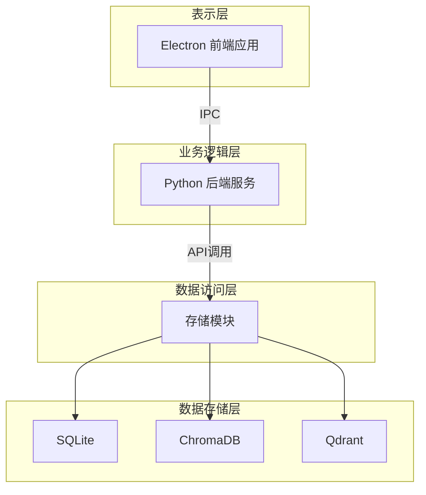
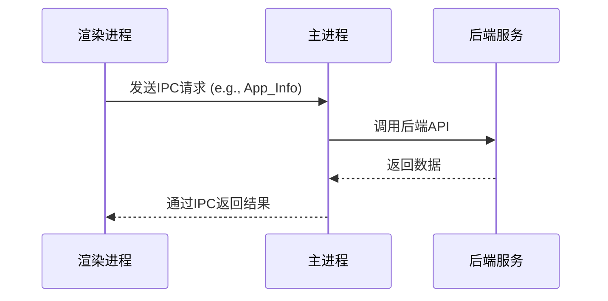
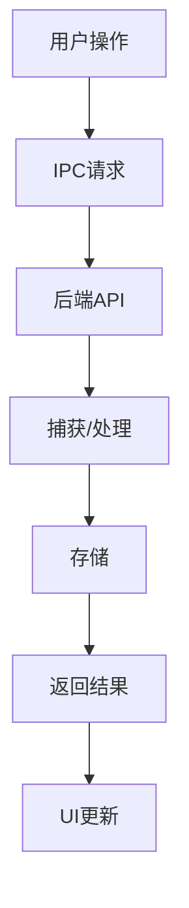

# 架构设计

<cite>
**本文档引用的文件**   
- [capture_manager.py](file://opencontext/managers/capture_manager.py)
- [processor_manager.py](file://opencontext/managers/processor_manager.py)
- [consumption_manager.py](file://opencontext/managers/consumption_manager.py)
- [opencontext.py](file://opencontext/server/opencontext.py)
- [ipc.ts](file://frontend/src/main/ipc.ts)
- [IpcChannel.ts](file://frontend/packages/shared/IpcChannel.ts)
- [unified_storage.py](file://opencontext/storage/unified_storage.py)
- [sqlite_backend.py](file://opencontext/storage/backends/sqlite_backend.py)
- [chromadb_backend.py](file://opencontext/storage/backends/chromadb_backend.py)
- [qdrant_backend.py](file://opencontext/storage/backends/qdrant_backend.py)
- [backend.ts](file://frontend/src/main/backend.ts)
</cite>

## 目录
1. [引言](#引言)
2. [分层架构概述](#分层架构概述)
3. [表示层（前端）](#表示层前端)
4. [业务逻辑层（后端服务）](#业务逻辑层后端服务)
5. [数据访问层（存储模块）](#数据访问层存储模块)
6. [数据存储层（数据库）](#数据存储层数据库)
7. [核心集成点：OpenContext类](#核心集成点opencontext类)
8. [进程间通信机制](#进程间通信机制)
9. [关键技术选型分析](#关键技术选型分析)
10. [结论](#结论)

## 引言
MineContext是一个基于Electron和Python的上下文感知AI助手，其架构设计遵循清晰的分层原则。本架构文档旨在深入解析其分层设计，涵盖从用户界面到数据存储的完整技术栈。系统通过`OpenContext`类作为核心集成点，协调`CaptureManager`、`ProcessorManager`和`ConsumptionManager`三大管理器，实现上下文的捕获、处理和消费。前端采用Electron框架，通过IPC机制与后端Python服务进行安全通信，后端则利用FastAPI提供高性能API服务，并通过模块化的Python包结构实现高内聚、低耦合的设计。

## 分层架构概述
MineContext的架构严格遵循分层设计模式，将系统划分为四个清晰的层次：表示层、业务逻辑层、数据访问层和数据存储层。这种分层设计确保了各层之间的职责分离，提高了系统的可维护性和可扩展性。

**Diagram sources**
- [opencontext.py](file://opencontext/server/opencontext.py)
- [ipc.ts](file://frontend/src/main/ipc.ts)
- [unified_storage.py](file://opencontext/storage/unified_storage.py)

**Section sources**
- [opencontext.py](file://opencontext/server/opencontext.py)
- [ipc.ts](file://frontend/src/main/ipc.ts)
- [unified_storage.py](file://opencontext/storage/unified_storage.py)

## 表示层（前端）
表示层由基于Electron框架的桌面应用构成，负责用户界面的渲染和用户交互。该层采用主进程（main process）和渲染进程（renderer process）分离的架构，以确保UI的响应性和安全性。

### 主进程与渲染进程
主进程负责管理应用的生命周期、创建浏览器窗口和处理系统级事件。渲染进程则在独立的沙箱环境中运行，负责渲染用户界面。这种分离设计防止了UI渲染中的潜在问题影响整个应用的稳定性。

### IPC通信机制
前端通过`IpcChannel.ts`定义的通道与后端进行通信。主进程中的`ipc.ts`文件注册了所有IPC处理器，处理来自渲染进程的请求，并将结果返回。这种机制确保了进程间通信的安全性，避免了直接暴露后端API。

**Diagram sources**
- [ipc.ts](file://frontend/src/main/ipc.ts)
- [IpcChannel.ts](file://frontend/packages/shared/IpcChannel.ts)

**Section sources**
- [ipc.ts](file://frontend/src/main/ipc.ts)
- [IpcChannel.ts](file://frontend/packages/shared/IpcChannel.ts)

## 业务逻辑层（后端服务）
业务逻辑层是系统的中枢，由Python后端服务实现，负责处理核心业务逻辑。该层通过FastAPI框架提供RESTful API，并由`OpenContext`类协调三大管理器。

### 核心管理器
- **CaptureManager**: 负责管理上下文捕获组件，如屏幕截图和文件监控。
- **ProcessorManager**: 负责处理捕获的原始数据，将其转换为结构化上下文。
- **ConsumptionManager**: 负责内容生成，如生成每日报告和智能提示。

### 数据流
用户操作触发前端IPC请求，经由主进程转发至后端API。后端服务调用相应的管理器处理请求，处理结果通过存储模块持久化，并最终返回给前端更新UI。

**Diagram sources**
- [opencontext.py](file://opencontext/server/opencontext.py)
- [capture_manager.py](file://opencontext/managers/capture_manager.py)
- [processor_manager.py](file://opencontext/managers/processor_manager.py)

**Section sources**
- [opencontext.py](file://opencontext/server/opencontext.py)
- [capture_manager.py](file://opencontext/managers/capture_manager.py)
- [processor_manager.py](file://opencontext/managers/processor_manager.py)

## 数据访问层（存储模块）
数据访问层由`unified_storage.py`实现，提供统一的存储接口，支持多种后端存储。该层通过工厂模式创建具体的存储后端，并根据数据类型自动路由。

### 存储后端工厂
`StorageBackendFactory`根据配置创建不同的存储后端实例，如ChromaDB用于向量存储，SQLite用于文档存储。

### 统一接口
`UnifiedStorage`类提供统一的API，如`batch_upsert_processed_context`和`search`，屏蔽了底层存储的复杂性，使上层业务逻辑无需关心具体存储实现。

**Section sources**
- [unified_storage.py](file://opencontext/storage/unified_storage.py)

## 数据存储层（数据库）
数据存储层包含多种数据库技术，以满足不同类型数据的存储需求。

### SQLite
用于存储结构化数据，如笔记、待办事项和活动记录。其表结构设计合理，支持高效的CRUD操作。

### ChromaDB和Qdrant
用于向量存储，支持基于语义的相似性搜索。两者均支持创建独立的集合来存储不同类型的上下文，如`activity_context`和`entity_context`。

**Section sources**
- [sqlite_backend.py](file://opencontext/storage/backends/sqlite_backend.py)
- [chromadb_backend.py](file://opencontext/storage/backends/chromadb_backend.py)
- [qdrant_backend.py](file://opencontext/storage/backends/qdrant_backend.py)

## 核心集成点：OpenContext类
`OpenContext`类是整个系统的核心集成点，负责协调所有组件。它在初始化时创建并初始化三大管理器，并通过回调函数将它们连接起来。

### 初始化流程
1. 初始化全局配置和存储实例。
2. 创建`CaptureManager`并设置回调函数。
3. 初始化捕获组件、处理器和消费组件。
4. 启动所有组件。

### 组件协调
`OpenContext`通过`_handle_captured_context`和`_handle_processed_context`等回调函数，实现组件间的松耦合通信。当捕获组件捕获到新数据时，会触发回调，数据随后被传递给处理器进行处理。

**Section sources**
- [opencontext.py](file://opencontext/server/opencontext.py)

## 进程间通信机制
进程间通信（IPC）是连接前端和后端的关键。Electron的IPC机制允许渲染进程与主进程通信，主进程再与后端服务交互。

### 通信流程
1. 渲染进程通过`ipcRenderer.invoke`发送请求。
2. 主进程的`ipcMain.handle`处理器接收请求并调用相应服务。
3. 服务处理完成后，结果通过IPC返回给渲染进程。

### 安全性
通过在`IpcChannel.ts`中明确定义通信通道，系统避免了任意代码执行的风险，确保了通信的安全性。

**Section sources**
- [ipc.ts](file://frontend/src/main/ipc.ts)
- [IpcChannel.ts](file://frontend/packages/shared/IpcChannel.ts)

## 关键技术选型分析
### FastAPI vs Flask
选择FastAPI而非Flask，主要基于其性能优势。FastAPI基于Starlette和Pydantic，支持异步处理，能够处理更高的并发请求，同时提供自动生成的API文档。

### 模块化Python包结构
采用模块化的包结构（如`managers`、`storage`、`context_processing`）提高了代码的可维护性。每个模块职责单一，便于独立开发和测试。

**Section sources**
- [opencontext.py](file://opencontext/server/opencontext.py)
- [api.py](file://opencontext/server/api.py)

## 结论
MineContext的架构设计体现了现代桌面应用的最佳实践。通过清晰的分层、松耦合的组件和高效的技术选型，系统实现了高性能、高可维护性和良好的用户体验。`OpenContext`类作为核心集成点，成功地协调了捕获、处理和消费三大流程，而Electron与Python的结合则充分发挥了各自的优势。