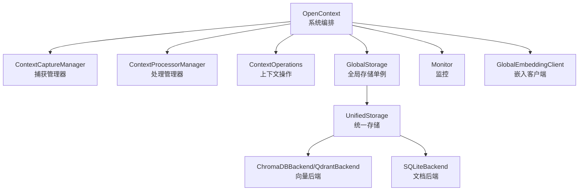
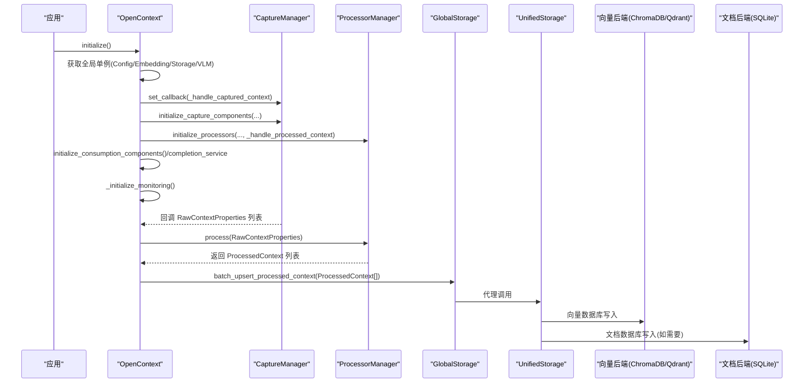
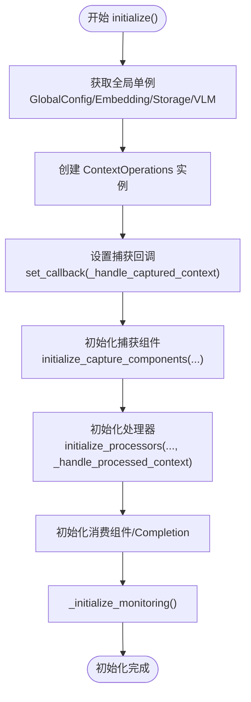
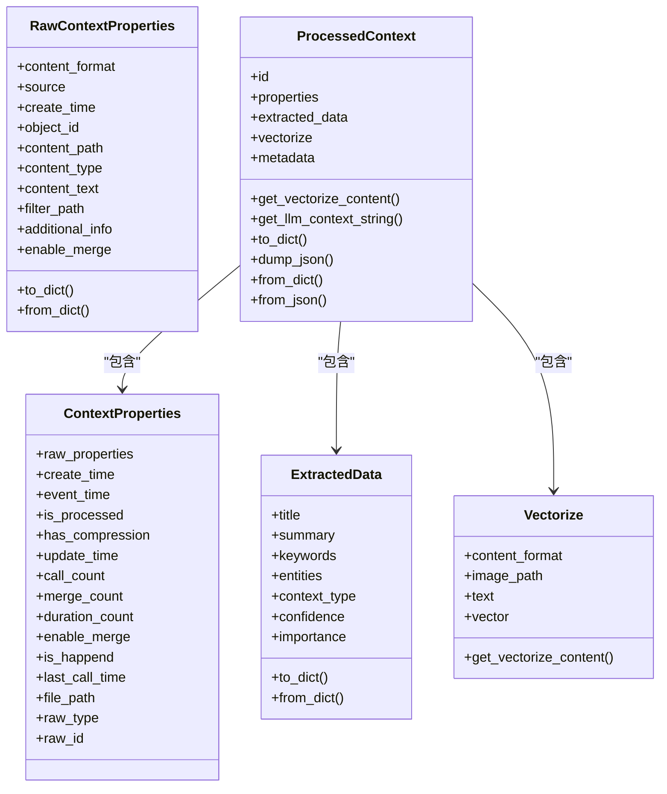
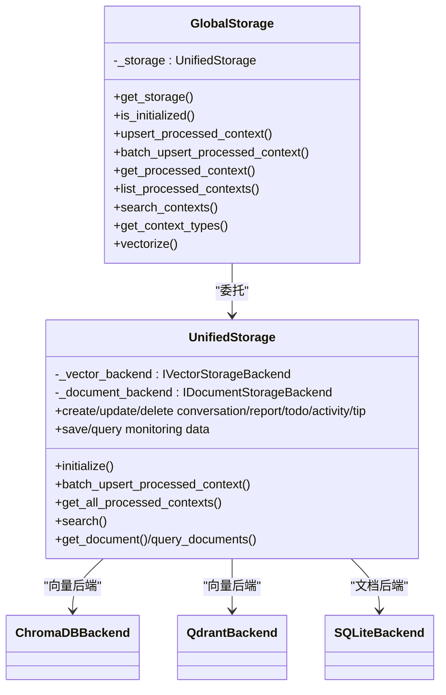
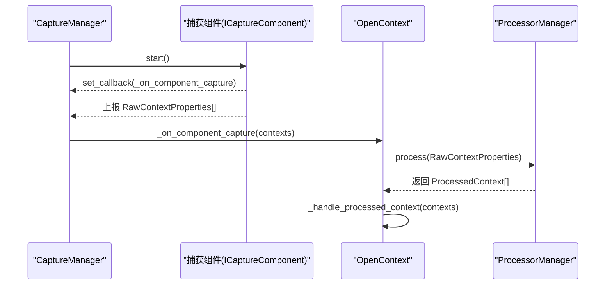
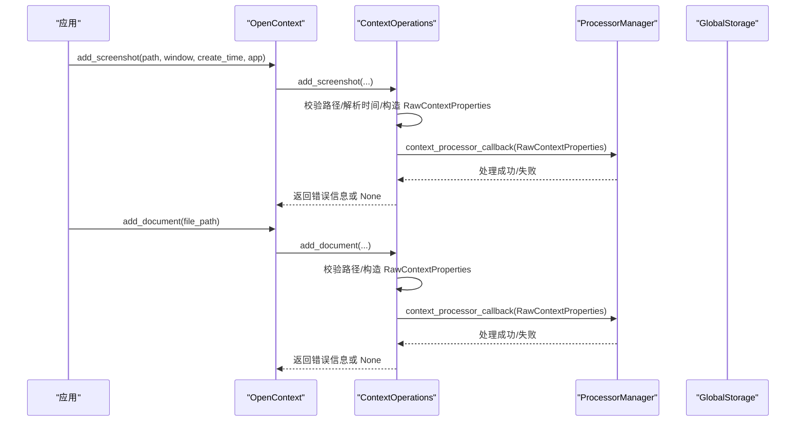
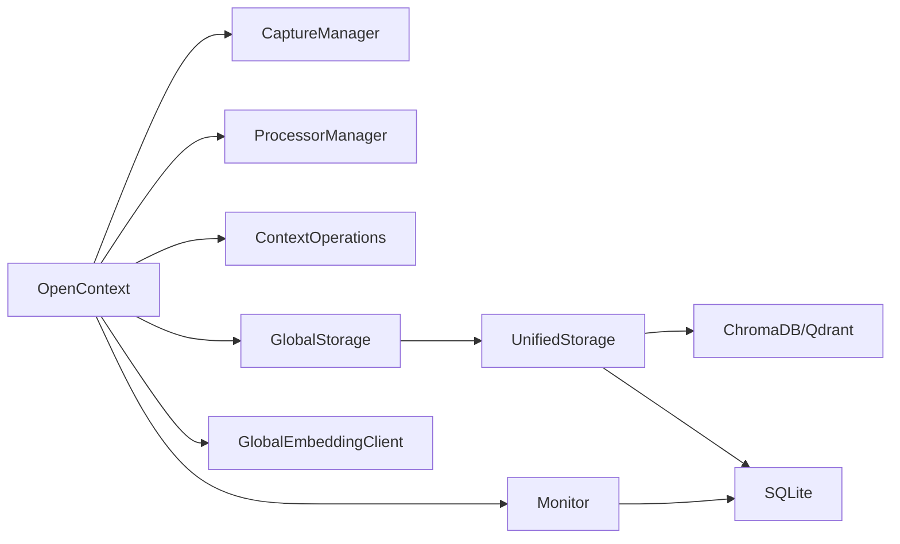

# 核心组件

<cite>
**本文引用的文件列表**
- [opencontext/server/opencontext.py](file://opencontext/server/opencontext.py)
- [opencontext/models/context.py](file://opencontext/models/context.py)
- [opencontext/storage/global_storage.py](file://opencontext/storage/global_storage.py)
- [opencontext/storage/unified_storage.py](file://opencontext/storage/unified_storage.py)
- [opencontext/storage/backends/chromadb_backend.py](file://opencontext/storage/backends/chromadb_backend.py)
- [opencontext/storage/backends/qdrant_backend.py](file://opencontext/storage/backends/qdrant_backend.py)
- [opencontext/storage/backends/sqlite_backend.py](file://opencontext/storage/backends/sqlite_backend.py)
- [opencontext/monitoring/monitor.py](file://opencontext/monitoring/monitor.py)
- [opencontext/server/context_operations.py](file://opencontext/server/context_operations.py)
- [opencontext/managers/capture_manager.py](file://opencontext/managers/capture_manager.py)
- [opencontext/managers/processor_manager.py](file://opencontext/managers/processor_manager.py)
- [opencontext/llm/global_embedding_client.py](file://opencontext/llm/global_embedding_client.py)
</cite>

## 目录
1. [简介](#简介)
2. [项目结构](#项目结构)
3. [核心组件](#核心组件)
4. [架构总览](#架构总览)
5. [详细组件分析](#详细组件分析)
6. [依赖关系分析](#依赖关系分析)
7. [性能考量](#性能考量)
8. [故障排查指南](#故障排查指南)
9. [结论](#结论)

## 简介
本文件聚焦于系统的核心构建块，围绕 OpenContext 类的初始化流程、数据模型、统一存储层以及健康检查能力进行深入解析，并给出通过 add_screenshot 和 add_document 注入新数据的使用路径与流程图示。

## 项目结构
系统采用模块化分层设计：
- 服务入口与编排：OpenContext 负责组件初始化、回调编排、对外 API 委托
- 数据模型：定义原始上下文、处理后上下文、向量化配置等核心数据结构
- 存储层：GlobalStorage 单例 + UnifiedStorage 统一管理多后端（SQLite、ChromaDB、Qdrant）
- 捕获与处理：CaptureManager 统一管理捕获组件；ProcessorManager 路由与批处理
- 监控：Monitor 提供指标采集与持久化
- LLM 客户端：GlobalEmbeddingClient 提供全局嵌入客户端访问

图表来源
- [opencontext/server/opencontext.py](file://opencontext/server/opencontext.py#L31-L120)
- [opencontext/storage/global_storage.py](file://opencontext/storage/global_storage.py#L23-L120)
- [opencontext/storage/unified_storage.py](file://opencontext/storage/unified_storage.py#L90-L170)
- [opencontext/storage/backends/chromadb_backend.py](file://opencontext/storage/backends/chromadb_backend.py#L122-L190)
- [opencontext/storage/backends/qdrant_backend.py](file://opencontext/storage/backends/qdrant_backend.py#L49-L78)
- [opencontext/storage/backends/sqlite_backend.py](file://opencontext/storage/backends/sqlite_backend.py#L40-L70)
- [opencontext/monitoring/monitor.py](file://opencontext/monitoring/monitor.py#L120-L140)
- [opencontext/llm/global_embedding_client.py](file://opencontext/llm/global_embedding_client.py#L23-L80)

章节来源
- [opencontext/server/opencontext.py](file://opencontext/server/opencontext.py#L31-L120)

## 核心组件
- OpenContext：系统主类，负责组件初始化、回调编排、对外 API 委托、健康检查
- 数据模型：RawContextProperties、ProcessedContext、Vectorize 等
- GlobalStorage：统一存储单例，提供便捷方法代理到 UnifiedStorage
- UnifiedStorage：统一存储入口，按类型路由到具体后端
- CaptureManager：捕获组件注册、启动、回调转发
- ProcessorManager：处理器注册、路由、批处理与周期性压缩
- Monitor：系统指标采集与持久化
- GlobalEmbeddingClient：嵌入客户端单例

章节来源
- [opencontext/server/opencontext.py](file://opencontext/server/opencontext.py#L31-L120)
- [opencontext/models/context.py](file://opencontext/models/context.py#L35-L202)
- [opencontext/storage/global_storage.py](file://opencontext/storage/global_storage.py#L23-L120)
- [opencontext/storage/unified_storage.py](file://opencontext/storage/unified_storage.py#L90-L170)
- [opencontext/managers/capture_manager.py](file://opencontext/managers/capture_manager.py#L23-L120)
- [opencontext/managers/processor_manager.py](file://opencontext/managers/processor_manager.py#L21-L120)
- [opencontext/monitoring/monitor.py](file://opencontext/monitoring/monitor.py#L120-L140)
- [opencontext/llm/global_embedding_client.py](file://opencontext/llm/global_embedding_client.py#L23-L80)

## 架构总览
OpenContext 将配置、LLM、存储、捕获、消费等子系统整合为统一入口，通过 ComponentInitializer 初始化捕获与处理器组件，随后在运行时通过回调链路完成“捕获 -> 处理 -> 存储”的闭环。

图表来源
- [opencontext/server/opencontext.py](file://opencontext/server/opencontext.py#L60-L120)
- [opencontext/managers/capture_manager.py](file://opencontext/managers/capture_manager.py#L264-L312)
- [opencontext/managers/processor_manager.py](file://opencontext/managers/processor_manager.py#L132-L160)
- [opencontext/storage/global_storage.py](file://opencontext/storage/global_storage.py#L122-L160)
- [opencontext/storage/unified_storage.py](file://opencontext/storage/unified_storage.py#L167-L210)

## 详细组件分析

### OpenContext 初始化流程与依赖关系
- 初始化顺序要点
  - 先获取全局单例：GlobalConfig、GlobalEmbeddingClient、GlobalStorage、GlobalVLMClient
  - 创建 ContextOperations 并设置捕获回调
  - 初始化捕获组件（CaptureManager）
  - 初始化处理器（ProcessorManager），并设置处理回调
  - 初始化消费组件与 Completion 服务
  - 初始化监控
- 关键回调链路
  - 捕获回调：_handle_captured_context -> ProcessorManager.process -> _handle_processed_context -> GlobalStorage.batch_upsert_processed_context
- 错误处理：初始化失败时触发 shutdown(graceful=False)，并抛出异常

图表来源
- [opencontext/server/opencontext.py](file://opencontext/server/opencontext.py#L60-L120)

章节来源
- [opencontext/server/opencontext.py](file://opencontext/server/opencontext.py#L60-L120)

### 数据模型：RawContextProperties 与 ProcessedContext
- RawContextProperties
  - 描述原始上下文属性，包含内容格式、来源、创建时间、对象标识、内容路径/文本、附加信息、是否启用合并等
  - 支持 to_dict/from_dict 序列化
- ProcessedContext
  - 描述已处理上下文，包含属性、抽取信息、向量化配置、元数据
  - 提供 get_llm_context_string 生成 LLM 输入字符串
  - 提供 to_dict/dump_json/from_dict/from_json 序列化支持
- Vectorize
  - 向量化配置，支持文本或图像输入，提供 get_vectorize_content

图表来源
- [opencontext/models/context.py](file://opencontext/models/context.py#L35-L202)

章节来源
- [opencontext/models/context.py](file://opencontext/models/context.py#L35-L202)

### GlobalStorage 单例与 UnifiedStorage 统一存储
- GlobalStorage
  - 单例封装，延迟自动初始化，提供 upsert/list/search/get 等便捷方法，内部委托给 UnifiedStorage
  - is_initialized 用于外部判断
- UnifiedStorage
  - 工厂模式创建后端实例，按存储类型（向量/文档）与默认策略选择后端
  - 对外暴露批量写入、查询、计数、搜索、对话与报告/待办/活动/提示等文档数据管理接口
  - 监控数据与消息管理也委托给文档后端
- 后端实现
  - ChromaDBBackend：本地持久或服务器模式，按 context_type 创建集合，支持待办去重集合
  - QdrantBackend：远程/本地客户端，按 context_type 创建集合，支持向量维度与 payload 序列化
  - SQLiteBackend：文档型数据表（vaults、todo、activity、tips、监控表等）

图表来源
- [opencontext/storage/global_storage.py](file://opencontext/storage/global_storage.py#L23-L120)
- [opencontext/storage/unified_storage.py](file://opencontext/storage/unified_storage.py#L90-L170)
- [opencontext/storage/backends/chromadb_backend.py](file://opencontext/storage/backends/chromadb_backend.py#L122-L190)
- [opencontext/storage/backends/qdrant_backend.py](file://opencontext/storage/backends/qdrant_backend.py#L49-L78)
- [opencontext/storage/backends/sqlite_backend.py](file://opencontext/storage/backends/sqlite_backend.py#L40-L70)

章节来源
- [opencontext/storage/global_storage.py](file://opencontext/storage/global_storage.py#L23-L120)
- [opencontext/storage/unified_storage.py](file://opencontext/storage/unified_storage.py#L90-L170)
- [opencontext/storage/backends/chromadb_backend.py](file://opencontext/storage/backends/chromadb_backend.py#L122-L190)
- [opencontext/storage/backends/qdrant_backend.py](file://opencontext/storage/backends/qdrant_backend.py#L49-L78)
- [opencontext/storage/backends/sqlite_backend.py](file://opencontext/storage/backends/sqlite_backend.py#L40-L70)

### 捕获与处理：CaptureManager 与 ProcessorManager
- CaptureManager
  - 组件注册/注销、初始化、启动/停止、统计、回调转发
  - 通过 set_callback 接收捕获组件上报的 RawContextProperties 列表，转发至 OpenContext 的回调
- ProcessorManager
  - 处理器注册、路由表（按 ContextSource 决定处理器）、单条/批量处理、周期性内存压缩
  - 通过回调将 ProcessedContext 列表返回给上层

图表来源
- [opencontext/managers/capture_manager.py](file://opencontext/managers/capture_manager.py#L135-L210)
- [opencontext/server/opencontext.py](file://opencontext/server/opencontext.py#L103-L139)
- [opencontext/managers/processor_manager.py](file://opencontext/managers/processor_manager.py#L132-L160)

章节来源
- [opencontext/managers/capture_manager.py](file://opencontext/managers/capture_manager.py#L23-L120)
- [opencontext/managers/processor_manager.py](file://opencontext/managers/processor_manager.py#L87-L120)
- [opencontext/server/opencontext.py](file://opencontext/server/opencontext.py#L103-L139)

### 健康检查：check_components_health()
- 监控的五个核心组件
  - config：GlobalConfig 是否初始化
  - storage：GlobalStorage 是否获取到底层 UnifiedStorage
  - llm：GlobalEmbeddingClient 与 GlobalVLMClient 是否初始化
  - capture：捕获管理器是否存在
  - consumption：消费管理器是否存在
- 返回字典形式的健康状态

章节来源
- [opencontext/server/opencontext.py](file://opencontext/server/opencontext.py#L260-L270)

### 注入新数据：add_screenshot 与 add_document
- add_screenshot
  - 参数：路径、窗口名、创建时间、应用名
  - 流程：校验路径存在性，构造 RawContextProperties（来源为截图、内容格式为图片），调用 ContextOperations.add_screenshot，最终通过回调进入 ProcessorManager.process
- add_document
  - 参数：文件路径
  - 流程：校验路径存在且为文件，构造 RawContextProperties（来源为本地文件、内容格式为文件），调用 ContextOperations.add_document，最终通过回调进入 ProcessorManager.process

图表来源
- [opencontext/server/opencontext.py](file://opencontext/server/opencontext.py#L226-L241)
- [opencontext/server/context_operations.py](file://opencontext/server/context_operations.py#L67-L151)
- [opencontext/managers/processor_manager.py](file://opencontext/managers/processor_manager.py#L132-L160)

章节来源
- [opencontext/server/opencontext.py](file://opencontext/server/opencontext.py#L226-L241)
- [opencontext/server/context_operations.py](file://opencontext/server/context_operations.py#L67-L151)

## 依赖关系分析
- 组件耦合
  - OpenContext 与 CaptureManager/ProcessorManager/ContextOperations 强耦合（回调与初始化）
  - GlobalStorage 与 UnifiedStorage 弱耦合（委托关系）
  - UnifiedStorage 与后端实现强耦合（工厂模式创建）
- 外部依赖
  - ChromaDB/Qdrant：向量数据库客户端
  - SQLite：文档型数据持久化
  - LLM 客户端：嵌入生成与向量化
- 监控依赖
  - Monitor 通过 GlobalStorage 的文档后端持久化指标

图表来源
- [opencontext/server/opencontext.py](file://opencontext/server/opencontext.py#L31-L120)
- [opencontext/storage/global_storage.py](file://opencontext/storage/global_storage.py#L23-L120)
- [opencontext/storage/unified_storage.py](file://opencontext/storage/unified_storage.py#L90-L170)
- [opencontext/monitoring/monitor.py](file://opencontext/monitoring/monitor.py#L120-L140)

章节来源
- [opencontext/server/opencontext.py](file://opencontext/server/opencontext.py#L31-L120)
- [opencontext/storage/unified_storage.py](file://opencontext/storage/unified_storage.py#L90-L170)

## 性能考量
- 批处理与并发
  - ProcessorManager 使用线程池执行批量处理，提升吞吐
- 向量写入优化
  - ChromaDB/Qdrant 支持批量 upsert，减少网络往返
- 监控与清理
  - Monitor 自动清理旧监控数据，默认保留 7 天
- 嵌入与向量化
  - GlobalEmbeddingClient 提供同步/异步向量化接口，避免重复计算

## 故障排查指南
- 初始化失败
  - 检查 GlobalConfig/Embedding/Storage/VLM 是否正确加载
  - 查看 OpenContext.initialize 中的异常日志
- 捕获组件问题
  - 使用 CaptureManager.get_statistics 查看组件统计与错误计数
- 处理器路由
  - 确认 ProcessorManager 的路由表与处理器注册情况
- 存储不可用
  - 通过 GlobalStorage.is_initialized 与 UnifiedStorage.initialize 返回值判断
  - 检查 ChromaDB/Qdrant/SQLite 后端连接与初始化日志
- 健康检查
  - 使用 check_components_health 快速定位 config/storage/llm/capture/consumption 五项组件状态

章节来源
- [opencontext/server/opencontext.py](file://opencontext/server/opencontext.py#L260-L270)
- [opencontext/managers/capture_manager.py](file://opencontext/managers/capture_manager.py#L357-L391)
- [opencontext/storage/unified_storage.py](file://opencontext/storage/unified_storage.py#L120-L170)
- [opencontext/monitoring/monitor.py](file://opencontext/monitoring/monitor.py#L120-L140)

## 结论
OpenContext 以 OpenContext 为核心，通过 CaptureManager/ProcessorManager 实现捕获与处理的解耦，借助 GlobalStorage/UnifiedStorage 提供统一的多后端存储抽象，配合 Monitor 完成可观测性闭环。check_components_health 为系统自检提供了清晰的健康度量。通过 add_screenshot/add_document 可快速注入新数据，形成从捕获到存储的完整链路。