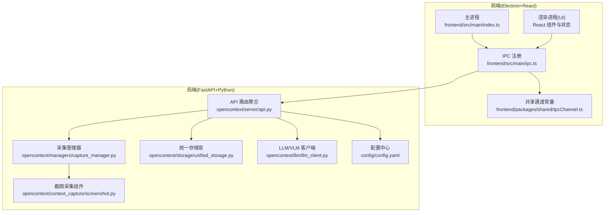
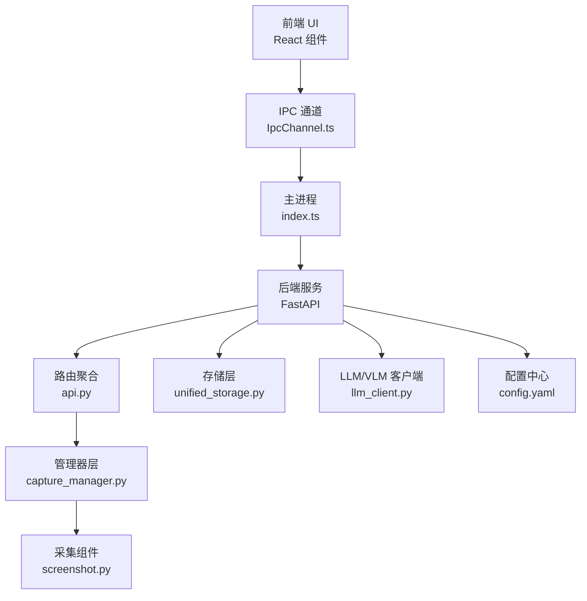
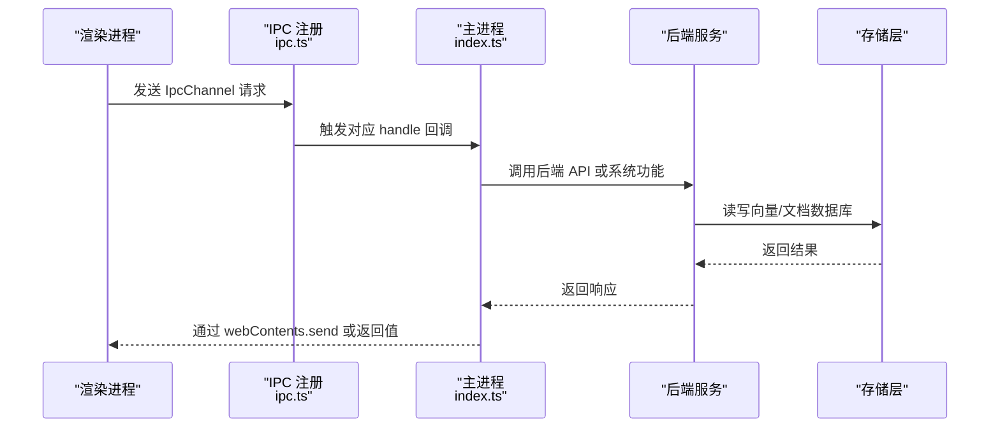
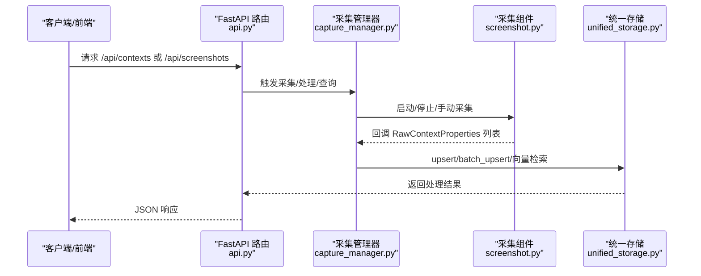
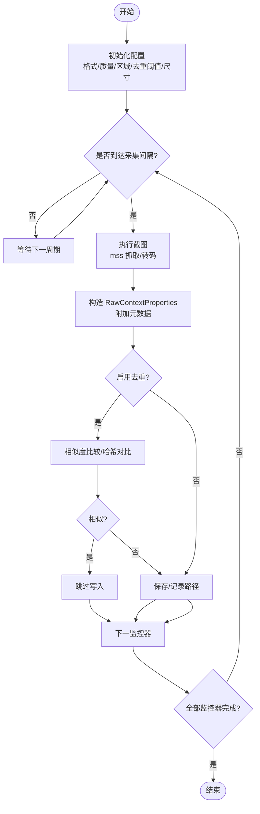
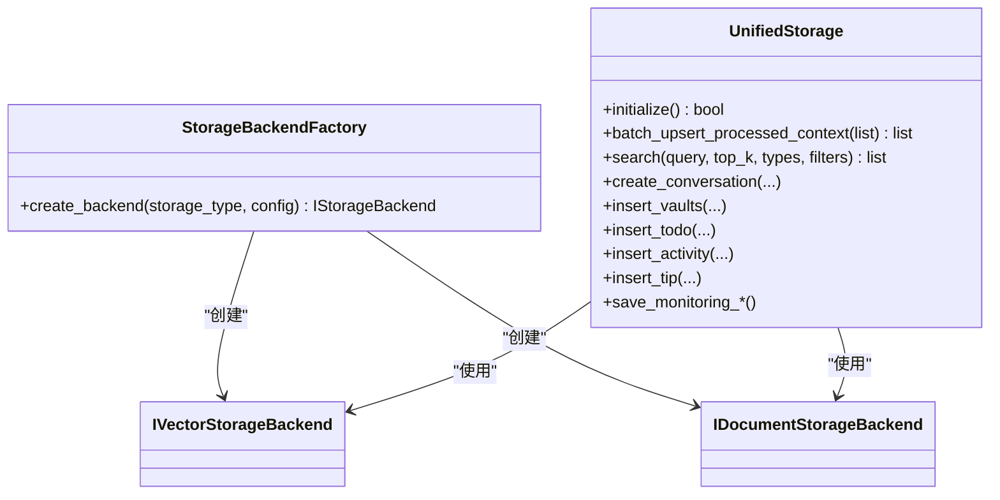
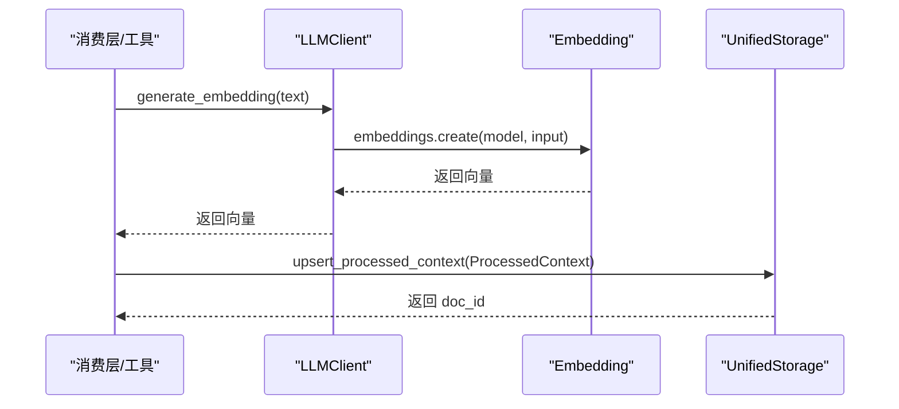
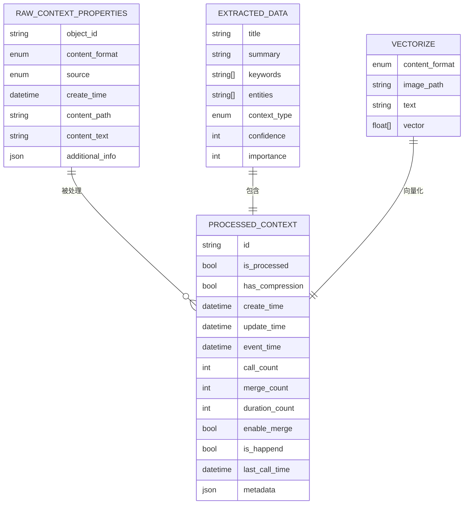
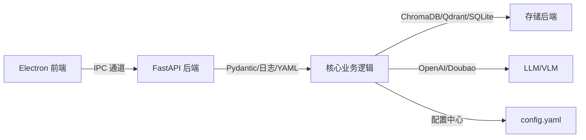

# 系统概述

<cite>
**本文引用的文件**
- [README.md](file://README.md)
- [package.json](file://package.json)
- [pyproject.toml](file://pyproject.toml)
- [frontend/src/main/index.ts](file://frontend/src/main/index.ts)
- [frontend/src/main/ipc.ts](file://frontend/src/main/ipc.ts)
- [frontend/packages/shared/IpcChannel.ts](file://frontend/packages/shared/IpcChannel.ts)
- [opencontext/server/api.py](file://opencontext/server/api.py)
- [opencontext/managers/capture_manager.py](file://opencontext/managers/capture_manager.py)
- [opencontext/context_capture/screenshot.py](file://opencontext/context_capture/screenshot.py)
- [opencontext/storage/unified_storage.py](file://opencontext/storage/unified_storage.py)
- [opencontext/llm/llm_client.py](file://opencontext/llm/llm_client.py)
- [config/config.yaml](file://config/config.yaml)
- [opencontext/models/context.py](file://opencontext/models/context.py)
</cite>

## 目录
1. [引言](#引言)
2. [项目结构](#项目结构)
3. [核心组件](#核心组件)
4. [架构总览](#架构总览)
5. [详细组件分析](#详细组件分析)
6. [依赖关系分析](#依赖关系分析)
7. [性能考量](#性能考量)
8. [故障排查指南](#故障排查指南)
9. [结论](#结论)
10. [附录](#附录)

## 引言
MineContext 是一款面向知识工作者与开发者的桌面级智能上下文管理工具，基于 Electron + React（前端）与 FastAPI + Python（后端）构建，结合本地优先的数据策略与多模态 AI 能力，实现对屏幕截图、文档、网页链接等多源上下文的自动化采集、处理、存储与消费，帮助用户在日常工作中获得更高效的信息组织与智能洞察。项目强调隐私保护与可扩展性，支持本地部署与自定义模型服务，并提供可视化调试界面以辅助开发与运维。

## 项目结构
项目采用前后端分离的模块化布局：
- 前端（Electron + React + TypeScript）
  - 主进程负责应用生命周期、窗口管理、安全 IPC、系统集成与后端服务启动；预加载脚本桥接 Node API 与渲染进程；渲染进程承载 UI 与状态管理。
- 后端（FastAPI + Python）
  - 提供 REST/WebSocket 接口、路由聚合、业务管理器、上下文采集/处理/存储/消费流水线、LLM/VLM 集成、监控与工具系统。
- 配置与资源
  - YAML 配置文件集中管理模型、采集、处理、存储、任务调度等参数；静态资源与打包配置由前端工程统一管理。

图表来源
- [frontend/src/main/index.ts](file://frontend/src/main/index.ts#L1-L348)
- [frontend/src/main/ipc.ts](file://frontend/src/main/ipc.ts#L1-L610)
- [frontend/packages/shared/IpcChannel.ts](file://frontend/packages/shared/IpcChannel.ts#L1-L349)
- [opencontext/server/api.py](file://opencontext/server/api.py#L1-L58)
- [opencontext/managers/capture_manager.py](file://opencontext/managers/capture_manager.py#L1-L391)
- [opencontext/context_capture/screenshot.py](file://opencontext/context_capture/screenshot.py#L1-L508)
- [opencontext/storage/unified_storage.py](file://opencontext/storage/unified_storage.py#L1-L925)
- [opencontext/llm/llm_client.py](file://opencontext/llm/llm_client.py#L1-L466)
- [config/config.yaml](file://config/config.yaml#L1-L253)

章节来源
- [README.md](file://README.md#L167-L270)
- [frontend/src/main/index.ts](file://frontend/src/main/index.ts#L1-L348)
- [frontend/src/main/ipc.ts](file://frontend/src/main/ipc.ts#L1-L610)
- [opencontext/server/api.py](file://opencontext/server/api.py#L1-L58)

## 核心组件
- 前端主进程与窗口管理
  - 负责应用生命周期、单实例锁、托盘、日志与性能监控、协议注册（vikingdb）、后台服务启动与关闭、定时任务与电源事件监听。
- IPC 通信与通道
  - 在主进程注册各类 IPC 处理器，覆盖应用信息、代理设置、缓存清理、数据库操作、屏幕监控、更新检查、托盘状态等；渲染进程通过共享通道常量与主进程通信。
- 后端 API 路由
  - 使用 FastAPI 聚合健康检查、Web 页面、上下文、内容生成、截图、调试、监控、Vaults、聊天、消息、文档等路由模块。
- 上下文采集管理器
  - 统一注册、初始化、启动/停止采集组件，回调式上报采集结果，统计与错误计数，支持手动触发采集。
- 截图采集组件
  - 周期性截图、区域截取、去重、保存、元数据记录、格式与质量控制、并发与批处理配置。
- 统一存储层
  - 多后端工厂模式，支持向量数据库（ChromaDB/Qdrant）与文档数据库（SQLite），提供批量写入、查询、相似度检索、监控数据落盘等能力。
- LLM/VLM 客户端
  - 支持 OpenAI/Doubao 协议，封装聊天、嵌入、流式响应、异步调用与令牌用量记录，提供配置校验与错误摘要提取。
- 配置中心
  - YAML 驱动的全局配置，包含日志、文档处理、VLM/Embedding 模型、采集开关、处理与合并策略、存储后端、Web 服务、鉴权、提示词语言、内容生成任务周期、工具引擎等。

章节来源
- [frontend/src/main/index.ts](file://frontend/src/main/index.ts#L1-L348)
- [frontend/src/main/ipc.ts](file://frontend/src/main/ipc.ts#L1-L610)
- [frontend/packages/shared/IpcChannel.ts](file://frontend/packages/shared/IpcChannel.ts#L1-L349)
- [opencontext/server/api.py](file://opencontext/server/api.py#L1-L58)
- [opencontext/managers/capture_manager.py](file://opencontext/managers/capture_manager.py#L1-L391)
- [opencontext/context_capture/screenshot.py](file://opencontext/context_capture/screenshot.py#L1-L508)
- [opencontext/storage/unified_storage.py](file://opencontext/storage/unified_storage.py#L1-L925)
- [opencontext/llm/llm_client.py](file://opencontext/llm/llm_client.py#L1-L466)
- [config/config.yaml](file://config/config.yaml#L1-L253)

## 架构总览
系统采用“前端 Electron + 后端 FastAPI”的双端架构，前端通过 IPC 与后端 API 交互，后端内部按“服务器层、管理器层、采集层、处理层、存储层、LLM 集成层”分层设计，清晰解耦职责，便于扩展与维护。

图表来源
- [frontend/packages/shared/IpcChannel.ts](file://frontend/packages/shared/IpcChannel.ts#L1-L349)
- [frontend/src/main/index.ts](file://frontend/src/main/index.ts#L1-L348)
- [opencontext/server/api.py](file://opencontext/server/api.py#L1-L58)
- [opencontext/managers/capture_manager.py](file://opencontext/managers/capture_manager.py#L1-L391)
- [opencontext/context_capture/screenshot.py](file://opencontext/context_capture/screenshot.py#L1-L508)
- [opencontext/storage/unified_storage.py](file://opencontext/storage/unified_storage.py#L1-L925)
- [opencontext/llm/llm_client.py](file://opencontext/llm/llm_client.py#L1-L466)
- [config/config.yaml](file://config/config.yaml#L1-L253)

## 详细组件分析

### 前端 IPC 与主进程交互流程
- 主进程在应用就绪时创建窗口、注册协议、启动后台服务、初始化托盘与定时任务，并在窗口关闭时隐藏而非退出，保持系统托盘常驻。
- 主进程通过 IPC 注册大量处理器，覆盖应用信息、代理、缓存、更新、权限检查、屏幕监控、数据库操作、托盘状态、热力图数据等。
- 渲染进程通过共享通道常量发起请求，主进程返回结果或触发系统行为，形成稳定的跨进程通信闭环。

图表来源
- [frontend/src/main/ipc.ts](file://frontend/src/main/ipc.ts#L1-L610)
- [frontend/src/main/index.ts](file://frontend/src/main/index.ts#L1-L348)
- [opencontext/storage/unified_storage.py](file://opencontext/storage/unified_storage.py#L1-L925)

章节来源
- [frontend/src/main/index.ts](file://frontend/src/main/index.ts#L1-L348)
- [frontend/src/main/ipc.ts](file://frontend/src/main/ipc.ts#L1-L610)
- [frontend/packages/shared/IpcChannel.ts](file://frontend/packages/shared/IpcChannel.ts#L1-L349)

### 后端 API 路由与管理器协作
- API 路由聚合器统一 include 各类子路由，包括健康检查、Web 页面、上下文、内容生成、截图、调试、监控、Vaults、聊天、消息、文档等。
- 管理器层协调采集组件，采集到的原始上下文经处理层转换为结构化数据，再写入存储层；消费层根据策略生成智能内容（活动、待办、提示）。

图表来源
- [opencontext/server/api.py](file://opencontext/server/api.py#L1-L58)
- [opencontext/managers/capture_manager.py](file://opencontext/managers/capture_manager.py#L1-L391)
- [opencontext/context_capture/screenshot.py](file://opencontext/context_capture/screenshot.py#L1-L508)
- [opencontext/storage/unified_storage.py](file://opencontext/storage/unified_storage.py#L1-L925)

章节来源
- [opencontext/server/api.py](file://opencontext/server/api.py#L1-L58)
- [opencontext/managers/capture_manager.py](file://opencontext/managers/capture_manager.py#L1-L391)
- [opencontext/context_capture/screenshot.py](file://opencontext/context_capture/screenshot.py#L1-L508)
- [opencontext/storage/unified_storage.py](file://opencontext/storage/unified_storage.py#L1-L925)

### 截图采集组件工作流
- 初始化阶段解析配置（格式、质量、区域、去重阈值、最大尺寸等），准备保存目录。
- 周期性执行截图，将图像转为二进制并构造 RawContextProperties，附加元数据（时间戳、监控器、标签等）。
- 去重策略基于相似度阈值与稳定截图缓存，避免重复写入与冗余存储。
- 支持优雅停止，提交剩余稳定截图并清空缓存。

图表来源
- [opencontext/context_capture/screenshot.py](file://opencontext/context_capture/screenshot.py#L1-L508)

章节来源
- [opencontext/context_capture/screenshot.py](file://opencontext/context_capture/screenshot.py#L1-L508)

### 统一存储层与多后端
- 工厂模式创建向量数据库（ChromaDB/Qdrant）与文档数据库（SQLite）后端，按配置初始化默认后端。
- 提供批量写入、查询、计数、相似度检索、对话/消息/报告/活动/待办/提示等结构化数据的 CRUD 能力。
- 监控数据落盘与趋势查询，支持清理旧数据。

图表来源
- [opencontext/storage/unified_storage.py](file://opencontext/storage/unified_storage.py#L1-L925)

章节来源
- [opencontext/storage/unified_storage.py](file://opencontext/storage/unified_storage.py#L1-L925)

### LLM/VLM 客户端与嵌入生成
- 封装 OpenAI 兼容接口，支持聊天、嵌入、流式与异步调用，自动记录令牌用量与阶段耗时。
- 提供配置校验与错误摘要提取，便于快速定位模型/配额/速率限制等问题。
- 与统一存储层配合，将文本/图像转换为向量并写入向量库，支撑检索与智能消费。

图表来源
- [opencontext/llm/llm_client.py](file://opencontext/llm/llm_client.py#L1-L466)
- [opencontext/storage/unified_storage.py](file://opencontext/storage/unified_storage.py#L1-L925)

章节来源
- [opencontext/llm/llm_client.py](file://opencontext/llm/llm_client.py#L1-L466)
- [opencontext/storage/unified_storage.py](file://opencontext/storage/unified_storage.py#L1-L925)

### 数据模型与上下文生命周期
- 原始上下文属性（RawContextProperties）描述来源、格式、路径、文本、附加信息等。
- 结构化上下文（ProcessedContext）包含抽取信息（标题、摘要、关键词、实体、类型、置信度、重要性）、向量化配置与元数据。
- API 模型（RawContextModel/ProcessedContextModel）用于序列化响应，便于前端展示与调试。

图表来源
- [opencontext/models/context.py](file://opencontext/models/context.py#L1-L343)

章节来源
- [opencontext/models/context.py](file://opencontext/models/context.py#L1-L343)

## 依赖关系分析
- 前端依赖
  - Electron 主进程与渲染进程通过 IPC 通道通信；预加载脚本桥接 Node API；共享通道常量统一命名。
- 后端依赖
  - FastAPI 提供路由与中间件；Pydantic 用于数据建模；日志、YAML、向量库（ChromaDB/Qdrant）、文档库（SQLite）、图像处理（Pillow）、PDF/Docx 等第三方库。
- 配置驱动
  - YAML 配置贯穿采集、处理、存储、任务调度、Web 服务与鉴权，确保运行时灵活切换。

图表来源
- [frontend/src/main/ipc.ts](file://frontend/src/main/ipc.ts#L1-L610)
- [opencontext/server/api.py](file://opencontext/server/api.py#L1-L58)
- [opencontext/storage/unified_storage.py](file://opencontext/storage/unified_storage.py#L1-L925)
- [opencontext/llm/llm_client.py](file://opencontext/llm/llm_client.py#L1-L466)
- [config/config.yaml](file://config/config.yaml#L1-L253)

章节来源
- [package.json](file://package.json#L1-L6)
- [pyproject.toml](file://pyproject.toml#L1-L99)
- [frontend/src/main/ipc.ts](file://frontend/src/main/ipc.ts#L1-L610)
- [opencontext/server/api.py](file://opencontext/server/api.py#L1-L58)
- [config/config.yaml](file://config/config.yaml#L1-L253)

## 性能考量
- 截图采集
  - 控制采集间隔、格式与质量、最大尺寸与缩放质量，减少带宽与存储压力；启用去重阈值降低冗余。
- 批处理与并发
  - 文档/截图处理器支持批大小与超时配置，平衡吞吐与延迟；向量检索 top_k 与过滤条件影响查询性能。
- 存储与索引
  - 向量维度裁剪与归一化可降低内存占用；选择合适的向量库（ChromaDB/Qdrant）与本地/服务端模式。
- 日志与监控
  - 记录阶段耗时与令牌用量，便于定位瓶颈；定期清理监控数据与旧截图，维持系统健康。

[本节为通用指导，不直接分析具体文件]

## 故障排查指南
- 模型配置校验失败
  - 使用 LLM 客户端的验证方法进行连通性测试，查看错误摘要（如配额不足、速率限制、无效密钥等），依据提示修正配置。
- 采集组件异常
  - 检查采集管理器统计与错误计数，确认组件初始化与启动状态；核对配置（格式、质量、区域、阈值）是否合理。
- 存储写入失败
  - 统一存储层初始化失败时，检查后端名称与类型匹配、默认后端选择、集合前缀与路径权限；关注批写入返回值与异常日志。
- IPC 通信问题
  - 确认通道常量一致，主进程已注册对应 handle；渲染进程发送请求后，检查主进程日志与返回值；必要时重启应用或清理缓存。

章节来源
- [opencontext/llm/llm_client.py](file://opencontext/llm/llm_client.py#L1-L466)
- [opencontext/managers/capture_manager.py](file://opencontext/managers/capture_manager.py#L1-L391)
- [opencontext/storage/unified_storage.py](file://opencontext/storage/unified_storage.py#L1-L925)
- [frontend/src/main/ipc.ts](file://frontend/src/main/ipc.ts#L1-L610)

## 结论
MineContext 通过 Electron + FastAPI 的双端架构，结合模块化的采集、处理、存储与消费流水线，实现了从屏幕截图到智能洞察的全链路自动化。前端提供直观的 UI 与托盘常驻体验，后端以 YAML 驱动的配置与多后端存储满足不同场景需求。项目强调本地优先与隐私保护，适合知识工作者与开发者在本地环境中持续迭代与扩展。

[本节为总结性内容，不直接分析具体文件]

## 附录
- 设计理念与目标用户
  - 以“本地优先”为核心，强调隐私与可控；面向知识工作者、内容创作者、终身学习者与项目经理，提供高效的信息组织与智能辅助。
- 技术选型背景
  - Electron 用于跨平台桌面应用开发，具备成熟的生态与打包能力；FastAPI 提供高性能、强类型与自动生成文档的 API；Python 生态覆盖 AI、图像、文档与数据库。
- 关键价值主张
  - 自动化采集与处理、本地存储与检索、多模态 AI 集成、Proactive 内容生成、可扩展的工具系统与调试界面。

章节来源
- [README.md](file://README.md#L413-L466)
- [README.md](file://README.md#L167-L270)