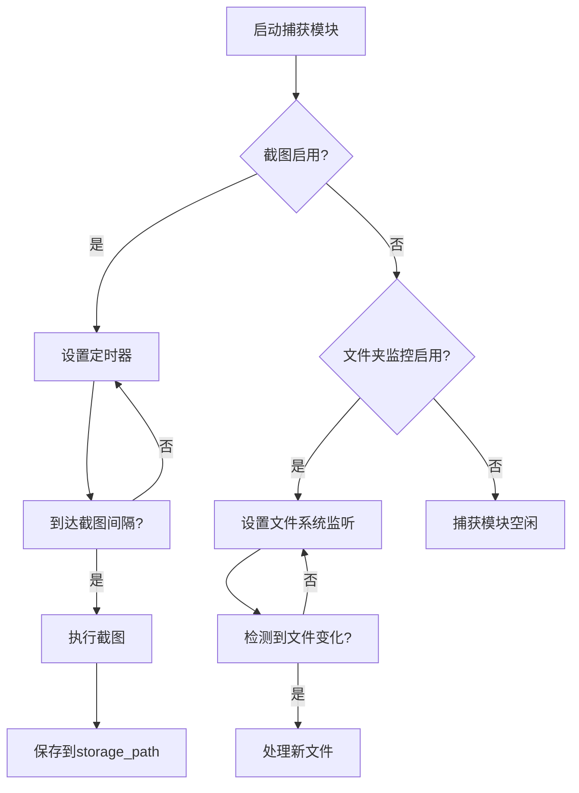
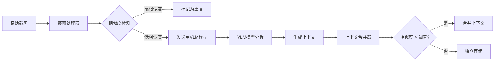
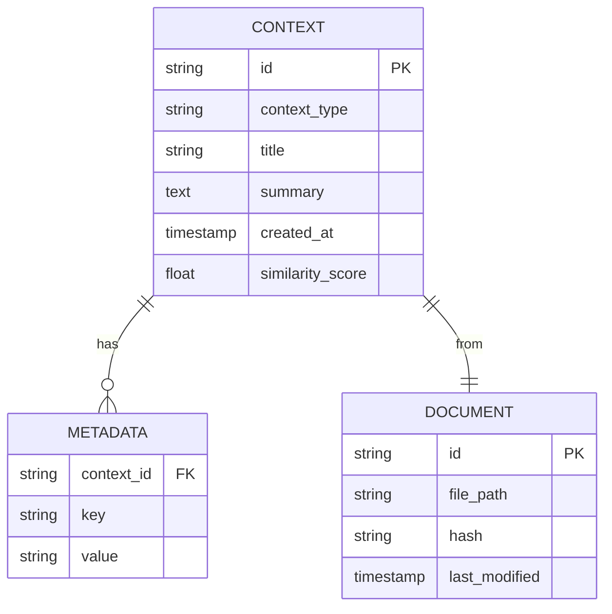
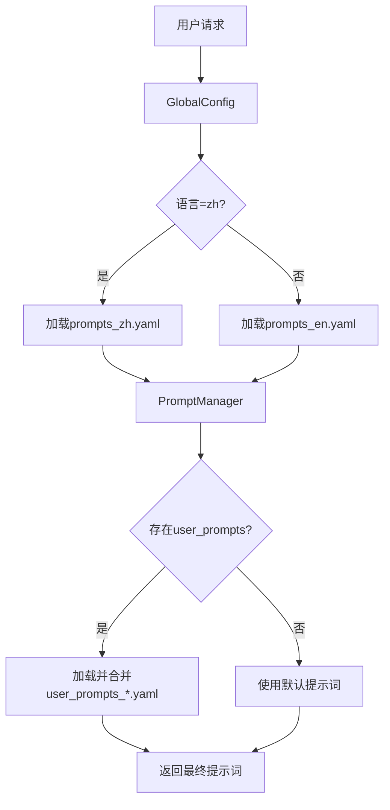
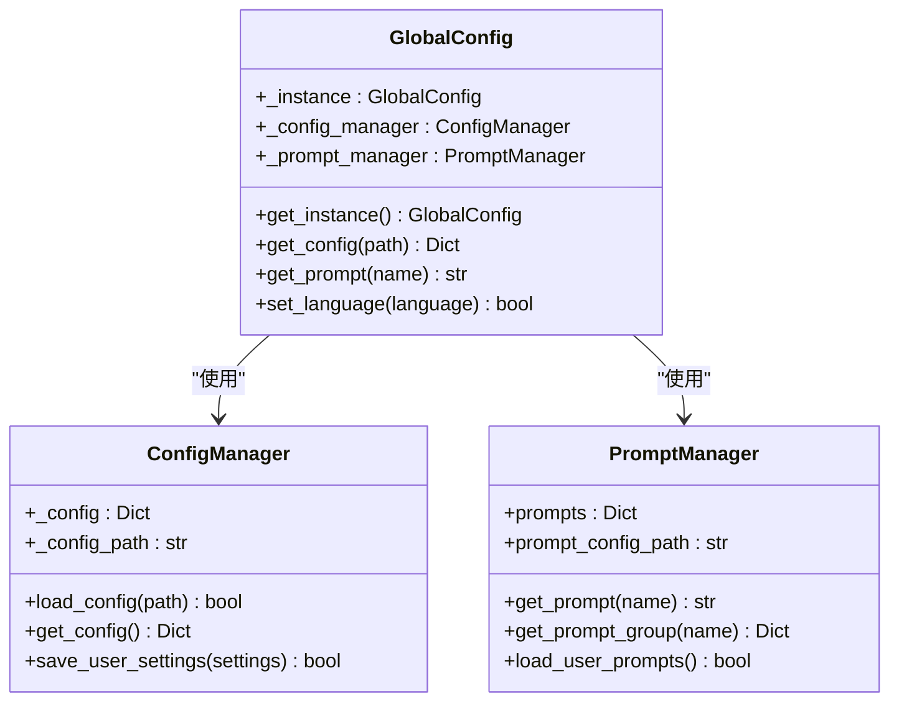

# 配置管理

<cite>
**本文档引用文件**  
- [config.yaml](file://config/config.yaml)
- [prompts_en.yaml](file://config/prompts_en.yaml)
- [prompts_zh.yaml](file://config/prompts_zh.yaml)
- [global_config.py](file://opencontext/config/global_config.py)
- [config_manager.py](file://opencontext/config/config_manager.py)
- [prompt_manager.py](file://opencontext/config/prompt_manager.py)
- [.env.example](file://frontend/.env.example)
</cite>

## 目录
1. [配置概览](#配置概览)
2. [捕获设置](#捕获设置)
3. [处理设置](#处理设置)
4. [存储后端配置](#存储后端配置)
5. [大模型API配置](#大模型api配置)
6. [提示词模板自定义](#提示词模板自定义)
7. [全局配置管理](#全局配置管理)
8. [前端环境变量](#前端环境变量)
9. [配置最佳实践](#配置最佳实践)

## 配置概览

`config.yaml` 文件是系统的核心配置文件，定义了从捕获、处理、存储到AI服务调用的完整工作流。该文件采用YAML格式，结构清晰，支持通过环境变量进行动态配置。配置项被组织为多个逻辑模块，包括 `capture`（捕获）、`processing`（处理）、`storage`（存储）、`llm`（大模型）等。系统通过 `GlobalConfig` 类统一管理这些配置，确保在整个应用生命周期中配置的一致性和可访问性。

**Section sources**
- [config.yaml](file://config/config.yaml#L1-L253)

## 捕获设置

`capture` 模块负责定义系统如何从用户环境中捕获上下文信息。它包含多种捕获方式，每种方式都有独立的配置项。

- **截图捕获 (`screenshot`)**: 通过 `enabled` 开关控制是否启用自动截图。`capture_interval` 定义了截图的频率（秒），较低的值能捕获更多细节但会增加系统负载和存储消耗。`storage_path` 指定了截图的保存目录，支持使用 `${CONTEXT_PATH:.}` 这样的环境变量来动态生成路径。
- **文件夹监控 (`folder_monitor`)**: 用于监控指定文件夹内的文件变化。`watch_folder_paths` 是一个列表，可以配置多个监控路径。`monitor_interval` 定义了检查文件变化的间隔。`max_file_size` 限制了单个文件的最大处理大小（字节），防止系统处理过大的文件。
- **文件监控 (`file_monitor`)**: 类似于文件夹监控，但更专注于特定文件。`monitor_paths` 指定要监控的文件或目录，`ignore_patterns` 允许使用通配符排除不需要的文件（如 `node_modules`）。
- **知识库文档监控 (`vault_document_monitor`)**: 专门用于监控用户知识库中的文档变更，确保系统能及时获取最新的文档内容。

**Diagram sources**
- [config.yaml](file://config/config.yaml#L39-L75)

**Section sources**
- [config.yaml](file://config/config.yaml#L39-L75)

## 处理设置

`processing` 模块定义了系统如何处理捕获到的原始数据，将其转化为结构化的上下文信息。

- **文档处理器 (`document_processor`)**: 负责处理PDF、Word等文档。`batch_size` 和 `batch_timeout` 控制了文档处理的批量大小和超时时间，用于平衡处理速度和资源占用。
- **截图处理器 (`screenshot_processor`)**: 专门处理截图数据。`dedup_cache_size` 和 `similarity_hash_threshold` 用于识别和去重相似的截图，避免重复处理。`max_image_size` 和 `resize_quality` 在保证识别精度的同时优化了内存和计算资源的使用。
- **上下文合并器 (`context_merger`)**: 这是一个高级功能，用于智能地合并相关的上下文片段。`similarity_threshold` 定义了两个上下文被视为“相似”并可合并的最低相似度。`use_intelligent_merging` 开启后，系统会根据上下文类型（如活动、状态、意图）应用不同的合并策略。`enable_cross_type_processing` 允许跨类型（如将活动上下文与状态上下文）进行关联和合并。

**Diagram sources**
- [config.yaml](file://config/config.yaml#L76-L143)

**Section sources**
- [config.yaml](file://config/config.yaml#L76-L143)

## 存储后端配置

`storage` 模块配置了系统的数据持久化方案，支持多种后端。

- **向量数据库 (`vector_db`)**: 用于存储和检索高维向量，是实现语义搜索的核心。系统默认使用 `chromadb`，通过 `mode: "local"` 以本地文件模式运行，`path` 指定了数据存储路径。注释掉的 `qdrant` 配置提供了一个可选的、功能更强大的向量数据库，适用于生产环境。
- **文档数据库 (`document_db`)**: 用于存储结构化的元数据和关系。系统使用 `sqlite` 作为轻量级的关系型数据库，`path` 指定了数据库文件的位置。

**Diagram sources**
- [config.yaml](file://config/config.yaml#L145-L182)

**Section sources**
- [config.yaml](file://config/config.yaml#L145-L182)

## 大模型API配置

`vlm_model` 和 `embedding_model` 配置项定义了系统与外部大模型API的连接方式。

- **VLM模型 (`vlm_model`)**: 视觉语言模型，用于分析截图内容。其 `base_url`、`api_key` 和 `model` 均通过环境变量 `${LLM_BASE_URL}`、`${LLM_API_KEY}` 和 `${LLM_MODEL}` 动态注入，这增强了安全性，避免了API密钥硬编码在配置文件中。
- **嵌入模型 (`embedding_model`)**: 用于将文本转换为向量。`output_dim` 必须与所选向量数据库（如Qdrant）的向量维度严格匹配，否则会导致数据写入失败。

**Section sources**
- [config.yaml](file://config/config.yaml#L26-L37)

## 提示词模板自定义

系统通过 `prompts_en.yaml` 和 `prompts_zh.yaml` 两个文件分别管理英文和中文的提示词模板。这些模板定义了AI在不同工作流节点（如意图分析、上下文收集、内容生成）中的行为。

- **多语言支持**: 系统根据 `config.yaml` 中 `prompts.language` 的设置（`zh` 或 `en`）加载对应的提示词文件。
- **模板结构**: 每个模板包含 `system` 和 `user` 两部分。`system` 指令定义了AI的角色、任务和行为准则，而 `user` 指令则定义了输入数据的格式。
- **自定义扩展**: 用户可以通过创建 `user_prompts_zh.yaml` 或 `user_prompts_en.yaml` 文件来覆盖或扩展默认提示词。`PromptManager` 类会自动加载并合并这些用户自定义的提示词。

**Diagram sources**
- [prompts_zh.yaml](file://config/prompts_zh.yaml#L1-L800)
- [prompts_en.yaml](file://config/prompts_en.yaml#L1-L800)
- [prompt_manager.py](file://opencontext/config/prompt_manager.py#L1-L220)

**Section sources**
- [prompts_zh.yaml](file://config/prompts_zh.yaml#L1-L800)
- [prompts_en.yaml](file://config/prompts_en.yaml#L1-L800)

## 全局配置管理

`GlobalConfig` 类是整个系统配置的单一入口点，采用单例模式，确保配置的全局唯一性。

- **初始化流程**: `GlobalConfig` 在首次被访问时，会自动初始化 `ConfigManager` 来加载 `config.yaml`，并根据配置中的语言设置初始化 `PromptManager` 来加载相应的提示词文件。
- **配置访问**: 提供了 `get_config(path)` 方法，允许通过点分隔的路径（如 `capture.screenshot.enabled`）访问深层配置项。`get_prompt(name)` 方法则用于获取特定的提示词。
- **动态更新**: `set_language(language)` 方法允许在运行时切换语言，它会重新加载提示词管理器，实现提示词的动态切换。

**Diagram sources**
- [global_config.py](file://opencontext/config/global_config.py#L1-L331)
- [config_manager.py](file://opencontext/config/config_manager.py#L1-L253)
- [prompt_manager.py](file://opencontext/config/prompt_manager.py#L1-L220)

**Section sources**
- [global_config.py](file://opencontext/config/global_config.py#L1-L331)

## 前端环境变量

前端项目中的 `.env.example` 文件定义了构建和发布应用所需的环境变量。

- **Apple开发者配置**: 包含 `APPLE_ID`、`APPLE_TEAM_ID` 和 `APPLE_APP_SPECIFIC_PASSWORD`，用于在macOS上对应用进行签名和公证。
- **代码签名**: `CSC_LINK` 指向 `.p12` 格式的代码签名证书文件，`CSC_KEY_PASSWORD` 是该证书的密码。
- **GitHub发布**: `GH_TOKEN` 用于在发布新版本时自动上传到GitHub Releases。

**Section sources**
- [.env.example](file://frontend/.env.example#L1-L27)

## 配置最佳实践

为了确保系统高效、安全地运行，遵循以下最佳实践至关重要。

- **平衡捕获频率**: 对于 `capture.screenshot.capture_interval`，建议在性能和信息完整性之间找到平衡。对于需要高精度记录的场景（如开发调试），可设置为5-10秒；对于日常使用，30秒或更长的间隔更为合适，以减少资源消耗。
- **安全管理API密钥**: 绝对不要将 `api_key` 直接写入 `config.yaml`。始终使用环境变量（如 `${LLM_API_KEY}`）并在系统环境或 `.env` 文件中定义它们。`.env` 文件应被添加到 `.gitignore` 中，防止密钥意外泄露。
- **利用用户自定义提示词**: 通过创建 `user_prompts_zh.yaml`，可以针对个人需求微调AI的行为。例如，修改 `processing.extraction.screenshot_contextual_batch.system` 中的描述风格，使其更符合个人偏好。
- **定期清理存储**: 启用 `context_merger.cleanup_interval_hours` 并设置合理的值（如24小时），让系统自动清理过期或低价值的上下文，避免存储空间无限增长。

**Section sources**
- [config.yaml](file://config/config.yaml#L45-L46)
- [config.yaml](file://config/config.yaml#L26-L28)
- [prompt_manager.py](file://opencontext/config/prompt_manager.py#L75-L94)